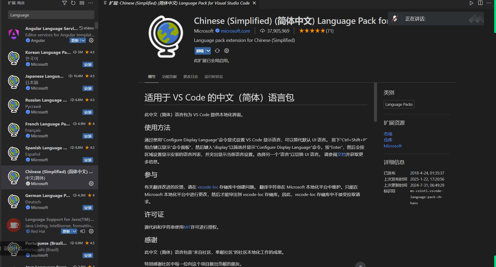
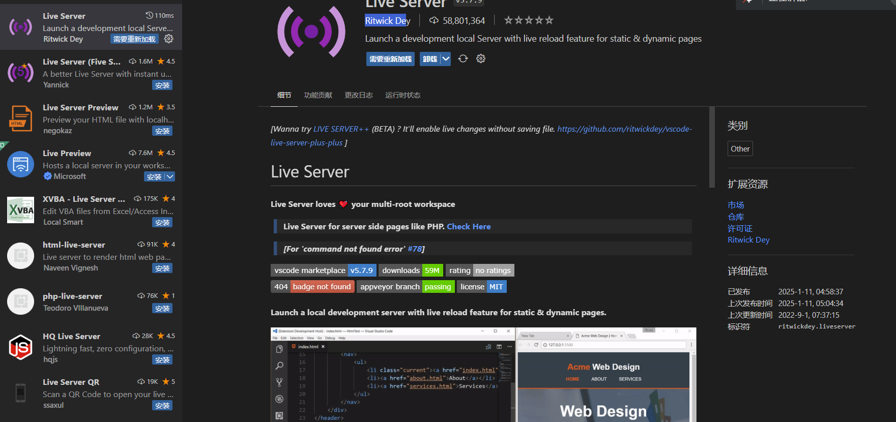
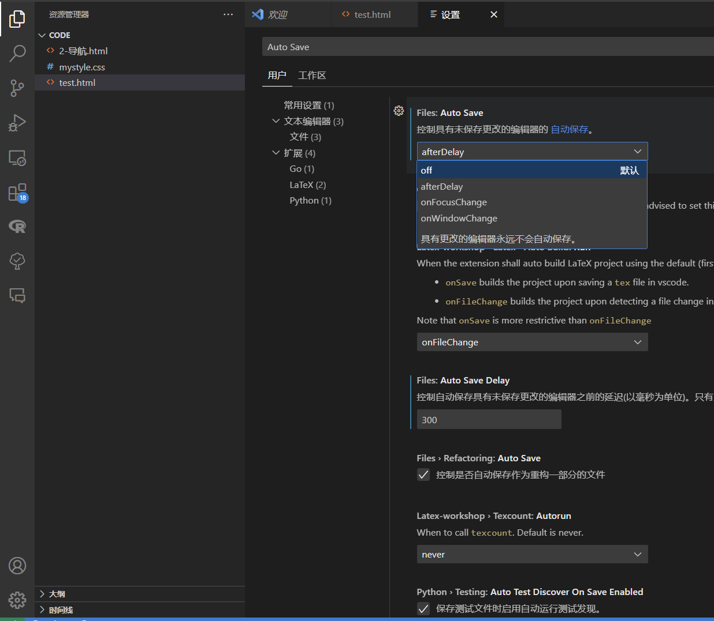

1.安装git

git: 用于管理代码版本的软件.

2.Typora

用于处理网页笔记的软件.

3.安装vscode插件1:

A.语言插件

安装中文插件:



B.Live Server插件:



C.vscode配置文件自动保存:



4.git clone代码

Reference: https://github.com/lz61/13-WebpageTeaching

进入git: 鼠标右键+s

注意win11: 需要显示更多选项

输入:

```
git clone https://github.com/lz61/13-WebpageTeaching
```

好处: 可以很方便地在开发者之间共享代码及文档.

5.