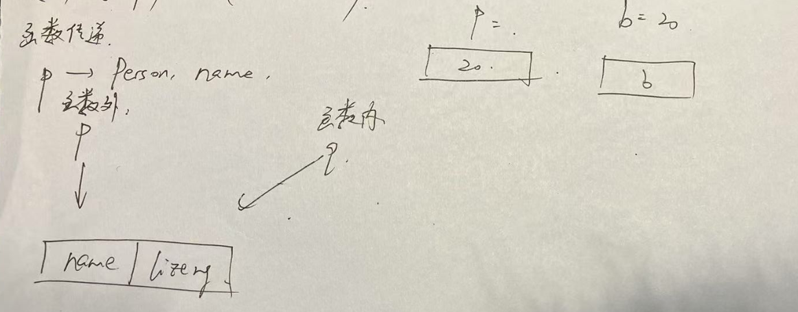

1.现在我们要来解决一个问题: 函数到底能不能改变传入对象的值?


2.回顾: 基本数据类型:

A.数值类型: number

B.字符串类型: string

C.布尔类型: boolean

D.未定义类型: undefined

E.查看数据类型的函数:

```
console.log(typeof(x));
```


注1: 基本数据类型的类型名都是首字母小写的.


3.引用数据类型:

A.对象类型(我更喜欢叫其字典类型): Object

研究对象类型变量的方法: "创初读修"

创:

```
var x = new Object();
```

初:

```
x={}; // 空对象
x={name:'鸡汤来咯',age:-1,weight:200}; // 
```

读:

访问方式类似类:

```
x.name; // 返回"鸡汤来咯"
```

修:

```
x.name="王大队长";
```


B.数组类型: 已经学过了.

引用数据类型的特点: 间接访问,


4.我们给函数传递的到底是什么?

事实上,我们给函数传递的,永远是外部值的复制.

对于引用类型,我们也总是会传递它的值的复制.

基础数据类型与引用数据类型的说明:



js和TS中: 给函数传递的永远都是值!

但是这个值到底是什么值,是需要搞清楚的.

5.事实上,函数不能改变传入对象的值,但是函数可以借助传入的对象改变传入的对象控制的值.