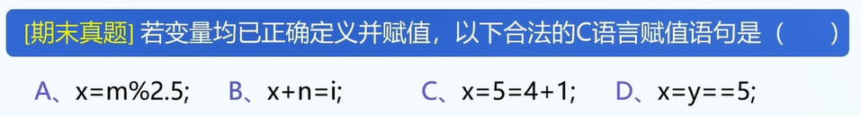
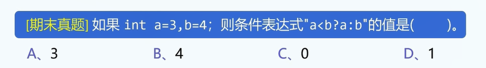
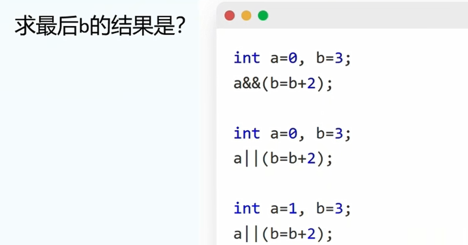
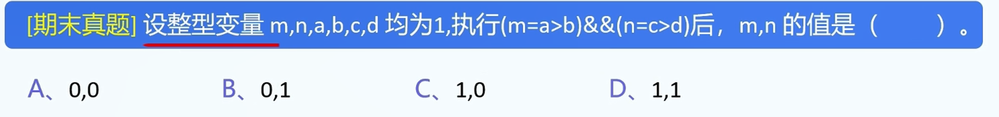
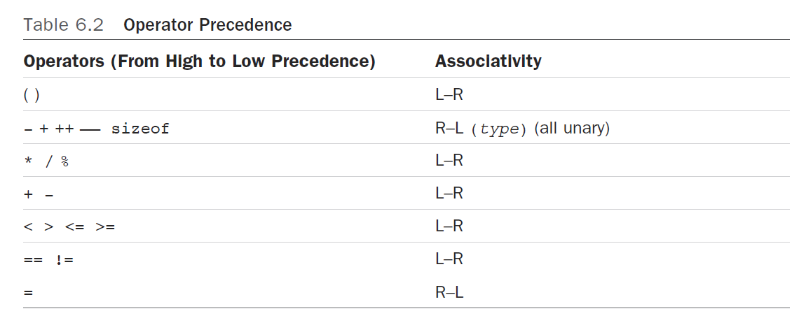

1.JS语言常用运算符:

```
= + - * / % ++ -- == ,
```

注1: 类似数学上的函数一样,每种运算符在参与运算后都会有一个返回值,例如:

```
1+2; // 返回3
// 1+2等价于3
2*4; // 返回8
// 2*4等价于8
```


2.=运算符

作用: 赋值

```
a=1; // 令a=1
```

返回值: 右操作数


3.+、-、*、/运算符: 均同实数算法

```
b=1;
c=2;
a=b+c; // a=3
a=b-c; // a=-1
a=b*c; // a=2
a=b/c; // a=0.5
```


5.%运算符

只支持整数%整数,其余操作会导致未知结果.

```
a=3%2; // a=1
a=2.5%2; // 未定义行为
```


6.++、--运算符效果

```
var a=3;

var b =a++; // 先返回a,a再++;
// b=3,a=4;
var b = ++a; // 返回a+1
// b=4,a=4;

var b = a--;
// b=3,a=2;
var b =--a;
// b=2,a=2
```


7.逗号的作用之一: 分割语句,顺次执行,返回最后一个表达式的结果.(不重要)

```
var sum=5;
var pad=5;
pad = ++sum, pad++, ++pad;
// 相当于:
// pad = ++sum;
// pad++;
// ++pad;
console.log("pad=",pad);
console.log("sum=",sum);
```

A.从左向右依次执行

B.整个表达式的结果是最后一个表达式的结果

答案:

```
// pad = ++ sum; pad++; ++pad;

// pad=6,sum=6

// pad=8,sum=6
```


8.逗号的作用之二: 同时申请多个变量

```
var x,y,z;
// 等价语句:
var x;
var y;
var z;
```


8.题目: 逗号的作用:

```
var a = 10;
var b = (a++, a+3, a-3);

var b = a++ , a+3 , a-3 ;
// var b = a++;
// a+3;
// 申请变量并输出: 可以与字符串拼接
console.log("b=",b);
```

答案: "b= 8"


9.表达式:

```
var a;
var b;
则表达式a=2,b=5,b++,a+b的值是
```


答案: B


10.+=,-=,*=,/=,%=各自作用

```
a+=3; // 等价:  a=a+3;

a/=2; // 等价: a=a/2;

a%=2; // 默认: a是整型
```


9.==运算符

作逻辑判断,返回值: true or false

在条件判断时比较有用.

10.真题




13.关系运算符

```
<=,>=,<,>,!=,==
```

A.返回结果: 


14.三目运算符

```
x>y?x:y;
[条件判断]?[值1]:[值2];
```


15.真题



16.逻辑运算符(推荐先讲控制语句-分支,再讲逻辑运算符&rarr;符合人类的认知理解)

逻辑非!,逻辑与&&,逻辑或||

!: 

&&: 只要有一个表达式为假,则右侧不会再进行计算

||: 只要有一个表达式为真,则右侧不会再进行计算

16.真题



```
各自三问的解:
b=3;
b=5;
b=3;
```

17.



18.运算符优先级

列举符号:

```
()
- + ++ -- sizeof
* / %
+ -
< > <= >=
== !=
=
```

运算符执行顺序:

1.左结合: 从左向右执行

大部分运算符都是从左向右执行的.

2.右结合: 从右向左执行.



