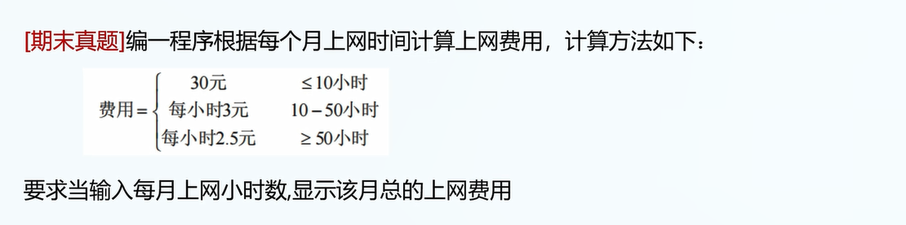
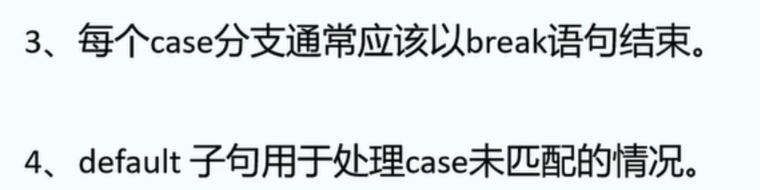
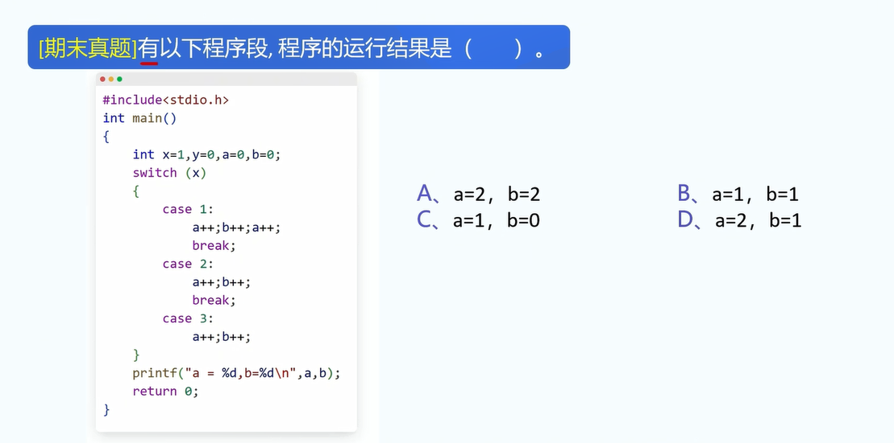
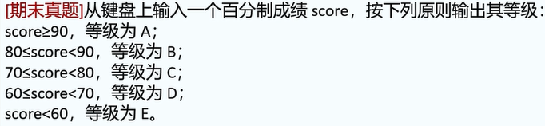

1.三种结构化程序: 顺序，选择，循环.

2.if语句的基本形式:

```
if(条件判断){
	执行语句; // 可以没有分号
}
```

实例:

```
if(x>0){
	printf("x不是一个负数\n");
	printf("x是一个正数");
}
```

附: 如果if内只嵌套一个语句,可以不写花括号.

```
// 正确的
if(x>0)
	printf("x是正数");

// 如果是两个语句:
if(x>0)
	printf("x是正数");
	x--; // x--会被默认执行
```

3.if+else:

```
if(x>0){
	printf("x是一个正数");
}
else{
	printf("x不是正数");
}
```

4.if+else if:

```
if(x>0){
	printf("x是一个正数");
}
else if(x==0){
	printf("x=0");
}
```

5.

```
var a=12;
var b=-34;
var c=56;
var min=0;
min=a;
if(min>b){
	min=b;
}
if(min>c){
	min=c;
}
console.log(min);
```

问运行结果?

答案: min=-34.

7.



答案:

```
	var hour = 0;
	hour = prompt("Input hour:");
	var payment = 0;
	if(hour<=10){
		payment = 30;
	}
	else if(hour<=50){
		payment = hour * 3;
	}
	else{
		payment = hour * 2.5;
	}
	console.log(payment);
}
```

8.switch分支结构:(js不重要,不用学)

基本形式:

```
switch(判断变量){
	case 常量1:
		...
		break;
	case 常量2:
		...
		break;
	...
	default:
		...
		break;
	
}
```

9.switch语句注意点



10.



11.

