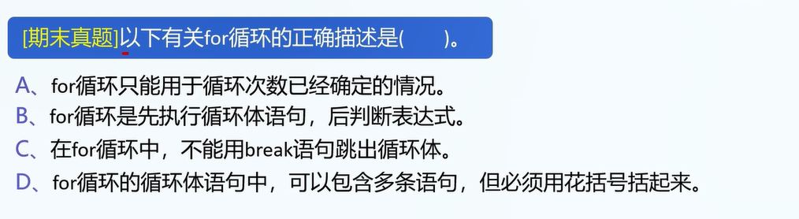

1.2种基本循环结构:

while,for循环


2.要求: 输出10个1

使用循环写,会比较便捷.

可行但很繁的写法:

```
console.log("1");
console.log("1");
console.log("1");
console.log("1");
console.log("1");
console.log("1");
console.log("1");
console.log("1");
console.log("1");
console.log("1");
```


2.while循环

```
// 语法:
while(expression){
	// do sth.
}

// 解决
var i=1;
while(i<=10){
	console.log("1");
	i++;
}
```

注1: 判断while循环执行的总次数:

```
1.看控制变量的开始值: 1
2.看控制变量的在执行最后一次循环时候的值: 10
3.看每次循环如何改变控制变量: 值++
4.计算: 1-10,每次加1: 执行10次
```


3.for循环

```
for(declaration;judgment;do sth.){
	// do sth.
}

// example(循环执行10次):
for(var i=0;i<10;i++){
	// do sth.
}

// 等价于:
var i=0;
while(i<10){
	// do sth.
	i++;
}

// 好用的for循环:
// 循环执行n次代码
for(var i=0;i<n;i++){
	// 遍历: 0-(n-1)的下标
}
```

5.break和continue语句:

break: 立即退出当前循环(如果有多个循环,只会退出当前循环)

注1: 事实上,break的作用是跳出当前的`{}`括起来的代码段.(如果讲过switch的话,结合switch-case语句讲解)

continue: 无视本次循环的剩余语句,立即进入下一次循环.


6.实例: break和continue

```
for(var i=0;i<10;i++){
	if(i==3)
		break;
	console.log(i);
}
// 输出: 0,1,2


for(var i=0;i<10;i++){
	if(i==3)
		continue;
	console.log("The value of i is %d\n",i);
}

// 输出: 0,1,2,4,5,6,7,8,9
```

注1: break的作用仅为跳出当前循环,若为多重循环只会跳出当前的这一重.

7.真题1



答案: D

8.真题2

```
对如下程序段的描述,正确的是:
var x=-1;
while(x<0){
	x=x*x;
}
A.是死循环
B.循环执行一次
C.循环执行两次
D.有语法错误
```

B

9.总结程序套路

```
// 1.申请变量
var 变量名;
// 2.处理用户输入
变量名 = prompt("输入你的话");
// 3.内部逻辑处理
处理变量值
// 4.输出答案
console.log("你想说的话");
```


10.真题3

求解: sum=1+2+3...+n,用户会从键盘输入n.

```
// 申请变量
var n=0,sum=0;

// 读取用户输入
n=prompt("请输入n");

// 内部处理逻辑
for(var i=0;i<n;i++){
	sum+=(i+1);
}

// 输出sum
console.log("sum=",sum);
```


10.题目4


```
// 申请变量
var sum=0;
// 处理用户输入
// 没有输入,不用处理
// 内部处理逻辑
for(var i=1;i<=100;i++){
	if(i%3==0){
		sum+=i;
	}	
}
// 输出答案
console.log("sum=",sum);
答案: 1683
```

11.题目5(如果题目4做出来了就不用做)

```
找出所有100-999内的数,它们满足:
百位数的三次方+十位数的三次方+个位数的三次方=它自己.
例:
153: 1的三次方+5的三次方+3的三次方=1+125+27=153=他自己.
154则不满足要求.
```

答案:

```
for(var i=100;i<=999;i++){
    var ge=i%10;
    var shi = ((i-ge)/10)%10;
    var bai = (i-shi*10-ge)/100;
    // console.log("ge:"+ge+" shi:"+shi+" bai:"+bai);
    if(i == ge*ge*ge+shi*shi*shi+bai*bai*bai){
        console.log(i);
    }
}
```


11.题目5(暂时不做,等学完数组和函数之后再做)

```
打印素数.
要求:
打印100-110之间的所有素数.
```

提示:

```
// 申请变量
// 处理用户输入
// 程序内部处理
// 输出答案
```

