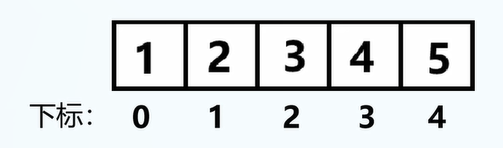
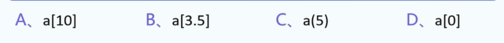

注: 记得让学生看完代码之后直接手打一遍代码.


所谓数据结构: 安排数据的一种结构.


1.引入数组的原因: 分类管理,将同样目标的数据统一存放.

例1.数组的好处.

请撰写程序,目标:

用户输入: 10个数值型变量

输出: 10个变量的和

js代码:

```js
var x1=0,x2=0,x3=0,x4=0,x5=0,x6=0,x7=0,x8=0,x9=0,x10=0;
x1 = prompt("输入x1");
x2 = prompt("输入x2");
x3 = prompt("输入x3");
x4 = prompt("输入x4");
x5 = prompt("输入x5");
x6 = prompt("输入x6");
x7 = prompt("输入x7");
x8 = prompt("输入x8");
x9 = prompt("输入x9");
x10 = prompt("输入x10");
var sum=x1+x2+x3+x4+x5+x6+x7+x8+x9+x10;
console.log("sum is",sum);
```


2.使用数组: 大幅简化程序撰写复杂度

```js
var x = new Array(10);
var sum = 0;
for (var i = 0; i < 10; i++) {
    // 记得强制类型转换.
    // 重申1: prompt返回值的类型是String(字符串)
    // 重申2: prompt只能接收一个参数
    outputString = "输入第"+ String(i) + "个数的值";
    s = prompt(outputString);
    // 重申2: Number()的强制类型转换函数
    x[i] = Number(s);
}

for (var i = 0; i < 10; i++) {
    sum += x[i];
}

console.log("sum=", sum);
```

注: C语言中数组不能放不同类型的值,而js中可以.


3.每种数据结构的学习方式: 创建,初始化,读取,修改.

四大天王: **创初读修**.

创建数据结构的别名: 声明.

初始化的别名: 赋值.

读取的别名: 查询.

记忆方式:

**“创初读修”**：

故事记忆法: 创业初期认真读书的人,迷信书本,修改了不少前人的做法,最后遗憾跳楼.


4.数组的创建与初始化

```
var x = new Array(2); // 括号中的参数2可以为任意正整数,此时x中的值都是undefined(没有初始化的数组内部值是undefined)
var x = [1,2,3,4,5]; // 直接初始化x
```

数组元素个数=数组长度=数组大小.

注1: 数组的长度必须为正整数,且数组长度在初始化时已然确定.

注2: 没有初始化的数组内部值是undefined.

5.真题1.

请用new和[]的方式申明长度为空的数组.

答案:

```
var x = [];
var x = new Array(0);
```


5.真题1:


```
A. var a=[1,2,3],;
B. var a={};
C. var a=;
D. var a=[1,2];
```

答案: D


6.数组元素的读取与修改

读取与修改统称为访问.

访问方式: 数组通过下标来访问元素,下标从0开始.

下标说明: 数组实例:

```
var arr=[1,2,3,4,5];
```

对应的下标:



```
通过[array_name][下标]即可访问.
// 合法下标范围: 0~(n-1)的整数

// 例:
var a=[1,2,3];
// 合法访问:
a[0],a[2];

// 不合法访问:
a[-1],a[3]; // 下标越界:导致undefined behavior(未定义行为).
```

一维数组元素的修改与读取(均与变量保持一致)：

修改:

```
var a = [1,2];
a[0]=2; // 修改数组变量,现在a=[2,2]
```

读取:

```
console.log(a[0]); // 输出2
```


7.真题1

```
已知: var a= new Array(10);
对a数组元素的正确引用是
```



答案: D


8.真题2

```
var a=[1,4,7,10,2,5,8,11,3,6,2,12];
// 括号: 从里往外算
求: a[a[10]]
选项:
A.10 B.9 C.6 D.7
```

答案: C


9.总结:

A.一维数组的创建：声明与初始化

B.一维数组元素的访问（读取与修改)

学习数据类型: 声明、初始化、读取、修改.

或者可以说,是**创建**与**访问**.


10.一维数组真题

要求: 直接输出即可,不需要接收用户输入.


```
// 输入:
c版本: 1.2 7 5 1.8 1.6 0.8 4 1.0 6 2.2
js版本: 1.2,7,5,1.8, 1.6, 0.8, 4, 1.0, 6, 2.2
// 代码:

// 1.申请变量
	var sum = 0, average = 0, a = [1.2,7,5,1.8, 1.6, 0.8, 4, 1.0, 6, 2.2];

// 2.处理用户输入: 不用处理

// 3.程序内部逻辑
	for(var i=0;i<10;i++){
		sum+=a[i];
	}
	average = sum / 10;
	var lessThanAverage=new Array(10);
	// index用于记录小于平均值的元素在数组lessThanAverage中的最大下标,index=最大下标+1
	var index = 0 ;
	for(var i=0;i<10;i++){
		if(a[i]<average){
			// 注意:i和index不要写反
			lessThanAverage[index]=a[i];
			index++;
		}	
	}

// 4.输出答案
	// index为实际有效的最大下标+1
	// 输出平均值
	console.log("average is %f\n",average);
	// 输出小于平均值的元素
    for(var i=0;i<index;i++){
    	console.log("Element is %f\n",lessThanAverage[i]);
    }
```

显示:


11.JS数组常用函数(讲完JS类之后再讲)


课后习题.

