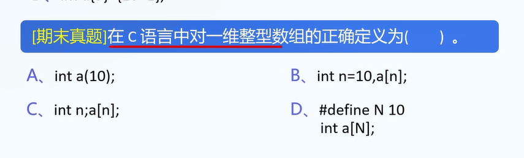
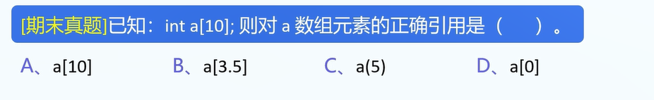
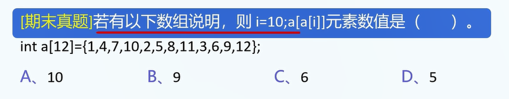
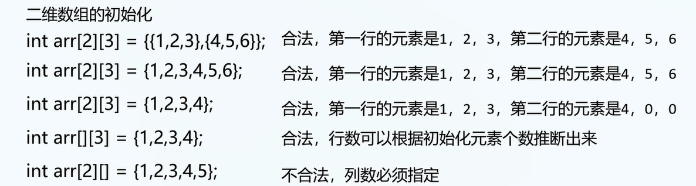
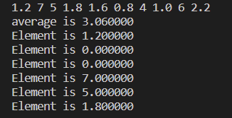

1.为什么要用数组?

用如下实例说明.

2.注: C语言中数组不能放不同类型的值,而js中可以.

例1.数组的好处.

请撰写程序,目标:

用户输入: 10个数值型变量

输出: 10个变量的和

js代码:

```
int main(void){
	var x1=0,x2=0,x3=0,x4=0,x5=0,x6=0,x7=0,x8=0,x9=0,x10=0;
	x1 = prompt("输入x1");
	x2 = prompt("输入x2");
	x3 = prompt("输入x3");
	x4 = prompt("输入x4");
	x5 = prompt("输入x5");
	x6 = prompt("输入x6");
	x7 = prompt("输入x7");
	x8 = prompt("输入x8");
	x9 = prompt("输入x9");
	x10 = prompt("输入x10");
    var sum=x1+x2+x3+x4+x5+x6+x7+x8+x9+x10;
    console.log("sum is",sum);
}
```

4.使用数组: 大幅简化程序撰写复杂度

```
var x = new Array(10);
var sum = 0;
for (var i = 0; i < 10; i++) {
    // 记得强制类型转换
    s = prompt("输入第", i, "个数的值")
    x[i] = Number(s);
}
for (var i = 0; i < 10; i++) {
    sum += x[i];
}
console.log("sum=", sum);
```

5.数组的特性

A.数组: 存储**相同类型**的数据.

B.数组的元素是连续存放的.

C.数组通过下标来访问元素,下标从0开始.

下标说明: 数组实例:

```
var arr=[1,2,3,4,5];
```

对应的下标:


6.每种数据结构的学习方式:

学习: 创建,初始化,读取,修改.

7.数组的声明与初始化(创建数组+数组赋值)

声明:

```
// 数组类型 数组名[数组大小];
var x = new Array(n); // n为任意正整数,此时x中的值都是undefined
var x = [1,2,3,4,5]; // 直接初始化x
var x = []; // 声明一个长度为空的数组
```

注1: 数组大小必须为正整数,且数组大小在初始化时已然确定.

C.没有初始化: 数组没有默认值,和没有初始化的x一样,都是垃圾值.

10.真题:


```
A. var a=[1,2,3,];
B. var a={};
C. var a=;
D. var a=[1,2];
```

答案: D


11.真题

在JS中对一维整型数组的正确定义为:




答案:D

12.数组元素的访问(access)

```
[array_name][下标]即可访问.
```

下标: 非负整数.

下标越界: 导致undefined behavior(未定义行为).

```
int a[n]; // 合法下标: 0-(n-1)
```




13.真题



答案: C

14.总结:

A.一维数组的创建：声明与初始化

B.一维数组元素的访问（读取与修改)

学习数据类型: 声明、初始化、读取、修改.

15.二维数组: 

数组: **存储相同类型**的数据.

二维数组: **存储一维数组**的数组.

声明: 

```
基本数据类型 数组名[行数][列数];
```

注: 接在数组屁股后面的括号可以留空,其余数字必须存在.

初始化:



16.真题


```
// 输入:
1.2 7 5 1.8 1.6 0.8 4 1.0 6 2.2
int main(void){
	float sum = 0;
	float average = 0;
	float a[10]={0};
	for(int i=0;i<10;i++){
		scanf("%f",&a[i]);
	}
	for(int i=0;i<10;i++){
		sum+=a[i];
	}
	average = sum / 10;
	float lessThanAverage[10]={0};
	int index = 0 ;
	for(int i=0;i<10;i++){
		if(a[i]<average){
			lessThanAverage[i]=a[index];
			index++;
		}	
	}
	// index为实际有效的index+1
	// 输出平均值
	printf("average is %f\n",average);
	// 输出小于平均值的元素
    for(int i=0;i<index;i++){
    	printf("Element is %f\n",lessThanAverage[i]);
    }
}


```

显示:



17.