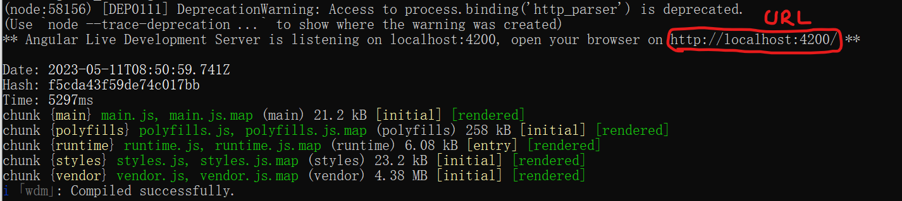
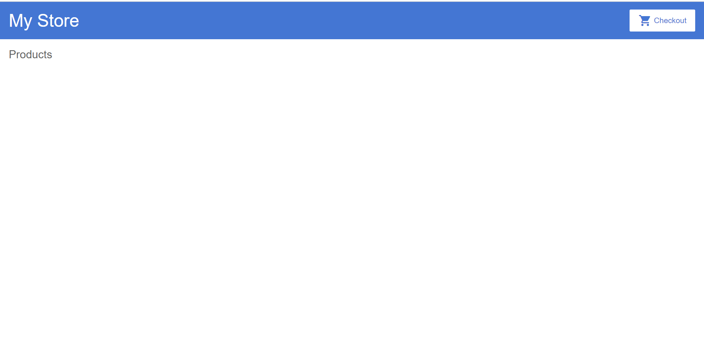

前置条件: 安装好了16.14.2的node版本

# 1. Angular起步

## 1.1 安装Angular CLI,版本:16.0.1

### 1.1.1 Angular CLI简述

Angular脚手架,以便一步安装并部署

### 1.1.2 安装CLI的cmd命令

```
npm install -g @angular/cli
指定版本:
npm install -g @angular/cli@16.0.1
```

命令含义:

-g: global

在本机上安装angular脚手架，以便在之后自己动手搭建项目。


### 1.1.3 检验安装是否成功

cmd命令

```
ng version
```

检查安装情况

期待：


只有16.14.2的node版本可以,18.16.0的node版本无法正常下载并安装node-CLI

## 1.2-部署项目demo

### 1.1.1-先下载[项目demo](https://github.com/2020-web/Lab2.1_Code-Angular_Demo)。

1.1.1.1去github下

1.1.1.2复制项目SSH地址

1.1.1.3git clone即可


### 1.1.2 准备电脑运行环境，并求神拜佛！！！最关键的一步！！！

**前置条件：(非常关键！！)**

安装环境：

1.不要开VPN

2.node version: 16.14.2

老老实实切换回16.14.2版本！！！

老老实实切换回16.14.2版本！！！

老老实实切换回16.14.2版本！！！

重要的事情说三遍！！！

最好先确认node version: 16.14.2完美(只用这个,和助教的保持一致.......!!!)

18.16.0版本完美自爆(有很多指令无法支持)：

尝试过但失败的解决方式：使用魔法指令（魔法指令后面也一堆错，真不如node 16.14.2 version一点儿）


### 1.1.3 在项目demo目录(`2-Lab2.1-Angular-Demo`)下运行命令

```
npm install
```

如果没啥问题的话，安装时请无视警告，安装时间较长，请耐心等待，即可过关。

如果有ERR而非WARNING，必须回到步骤1.1.2，仔细准备电脑运行环境，并删除当前文件夹下的所有

```
node_modules
```

文件，实在不行直接回到步骤1.1.1重新开始战斗！！！


### 1.1.4 再执行命令

```
ng serve
```

以在本地运行服务器。

期待结果：



### 1.1.5 将上图中的URL内容复制到浏览器输入框中

```
本次URL:
http://localhost:4200/
```

### 1.1.6-获得运行页面



### 1.1.7-软件注释

在这个初始应用程序中，定义了一个带有带有顶栏的框架（包含商店名称和结账图标）

以及一个产品列表的标题（它将用来自应用中的数据填充并动态更新产品列表）。

### 1.1.8-接下来阅读的文档

可以选择`2-官方文档`或`3-助教文档`

个人推荐`2-官方文档`，因为其较为正规，且是英文......中文文档实在写的一般。

## 1.3 新建一个自己的项目

### 1.3.1 创建工作区和初始应用

Angular工作区就是你开发应用的上下文环境。

运行 CLI 命令 `ng new` 生成一个新项目以及应用的⻣架代码：

```
ng new angular-learning
```

`ng new` 会提示你要把哪些特性包含在初始的应用项目中。请按回⻋接受默认值。

Angular CLI会安装必要的Angular npm包及其它依赖。这可能要花几分钟。

### 1.3.2 启动开发服务器

如果你使用node 18开发时，请退回到版本16或者使用魔法指令部署该Angular服务器。

node 18 就是不行

我就老老实实退回node 16吧

node : 16.14.2即可

## 1.4 参考链接

angular官方网站教程-教你做一个简单商业网站

官网教程：https://angular.io/start

