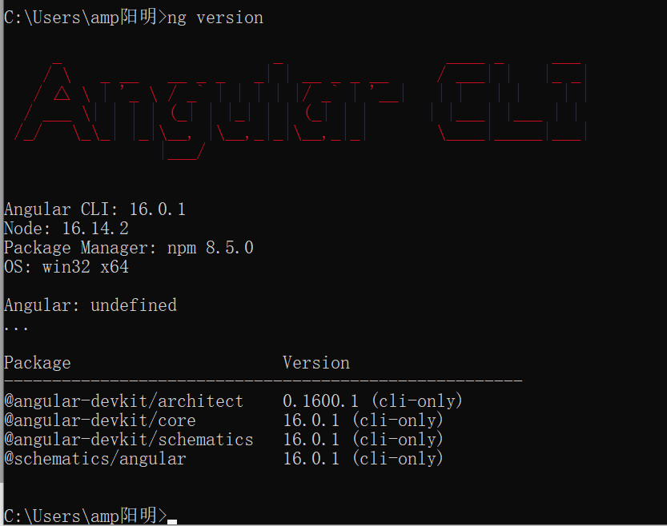

# 0. 安装node16.14.2, npm8.5.0

如果下载过慢,可以设置镜像源:

```
# 腾讯源:
npm config set registry http://mirrors.cloud.tencent.com/npm/
# 不要用淘宝源(不靠谱):
npm config set registry https://registry.npm.taobao.org
```

如果需要切换版本,可以用:

```
nvm list // 查看所有版本
nvm use [版本名num] // 切换到指定版本
```

切换.

## 0.1 windows Node下载

LTS-Long-Term Support

1.**Download Node.js Installer:**

https://nodejs.org/en/blog/release/v16.14.2

2.**Verify Installation:**

After the installation is complete, open a new terminal or command prompt and run the following commands to verify that Node.js and npm (Node Package Manager) are installed:

```
node -v
npm -v
```

## 0.2 Linux Node下载

无外网: Workaround: 下载.tar.gz文件,解压到对应文件夹,再将nvm挂载到系统路径.

https://github.com/nvm-sh/nvm/releases

nvm&rarr;node和npm&rarr;Angular/CLI

如果有外网:

clash/ v2ray for linux?

Reference: chatGPT

1.Install nvm:

```
curl -o- https://raw.githubusercontent.com/nvm-sh/nvm/v0.38.0/install.sh | bash
curl -o- https://gitee.com/mirrors/nvm/raw/v0.38.0/install.sh | bash
```

2.Install Node.js 16.14.2:

```
nvm install 16.14.2
```

3.Set Default Node.js Version:

If you want to set Node.js version 16.14.2 as the default version, you can use:

```
nvm alias default 16.14.2
```

4.Verify node installation:

```
node -v // should be 16.14.2
npm -v // should be 8.5.0
```

5.Install Angular CLI:

```
npm install -g @angular/cli@16.0.1
```

6.Verify Angular Installation:

```
ng version
```


# 1. Angular起步

(我的远程Linux实在太拉跨了)

## 1.1 安装Angular CLI,版本:16.0.1

### 1.1.1 Angular CLI简述

Angular 可执行程序,Angular脚手架,以便一步安装并部署

### 1.1.2 安装CLI的cmd命令

```
npm install -g @angular/cli
指定版本:
npm install -g @angular/cli@16.0.1
```

命令含义:

-g: global

在本机上安装angular脚手架，以便在之后自己动手搭建项目。

最好有VPN再装.

### 1.1.3 检验安装是否成功

cmd命令

```
ng version
```

检查安装情况

期待：



只有16.14.2的node版本可以,18.16.0的node版本无法正常下载并安装node-CLI

## 1.2 部署项目demo

### 1.1.1 下载[项目demo](https://github.com/2020-web/Lab2.1_Code-Angular_Demo)

### 1.1.2 准备电脑运行环境，并求神拜佛！！！最关键的一步！！！

**前置条件：(非常关键！！)**

安装环境：

1.不要开VPN

2.node version: 16.14.2

老老实实切换回16.14.2版本！！！

老老实实切换回16.14.2版本！！！

老老实实切换回16.14.2版本！！！

重要的事情说三遍！！！

最好先确认node version: 16.14.2完美(只用这个,和助教的保持一致.......!!!)

18.16.0版本完美自爆(有很多指令无法支持)：

尝试过但失败的解决方式：使用魔法指令（魔法指令后面也一堆错，真不如node 16.14.2 version一点儿）


### 1.1.3 在项目demo目录(`2-Lab2.1-Angular-Demo`)下运行命令

```
npm install
```

如果没啥问题的话，安装时请无视警告，安装时间较长，请耐心等待，即可过关。

如果有ERR而非WARNING，必须回到步骤1.1.2，仔细准备电脑运行环境，并删除当前文件夹下的所有

```
node_modules内
```

文件，实在不行直接回到步骤1.1.1重新开始战斗！！！


### 1.1.4 再执行命令

```
ng serve
```

以在本地运行服务器。

期待结果：


### 1.1.5 将上图中的URL内容复制到浏览器输入框中

```
本次URL:
http://localhost:4200/
```

### 1.1.6-获得运行页面


## 1.3 网页说明(结合源代码)

### 1.3.1 顶层

My Store + Checkout图标

中层: Products

对应代码:

### 1.1.8-接下来阅读的文档

可以选择`2-官方文档`或`3-助教文档`

个人推荐`2-官方文档`，因为其较为正规，且是英文......中文文档实在写的一般。

## 1.3 新建一个自己的项目

### 1.3.1 创建工作区和初始应用

Angular工作区就是你开发应用的上下文环境。

运行 CLI 命令 `ng new` 生成一个新项目以及应用的⻣架代码：

```
ng new angular-learning
```

`ng new` 会提示你要把哪些特性包含在初始的应用项目中。请按回车接受默认值。

Angular CLI(脚手架)会安装必要的Angular npm包及其它依赖。这可能要花几分钟。

### 1.3.2 启动开发服务器

如果你使用node 18开发时，请退回到版本16或者使用魔法指令部署该Angular服务器。

node 18 就是不行

我就老老实实退回node 16吧

node : 16.14.2即可

## 1.4 参考链接

angular官方网站教程-教你做一个简单商业网站

官网教程：https://angular.io/start


# 5. npm包管理器

app.module.ts

控制整个app包的导入和使用

