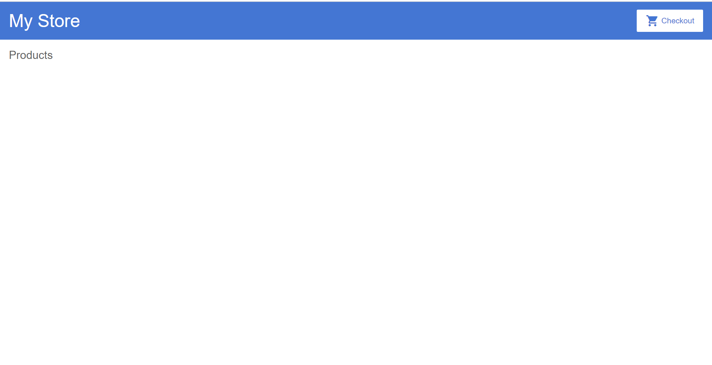

1.Angular简介

简述Angular: 如果说html,css,js组成了一个页面的基本要素,那么Angular就大幅简化了程序员在撰写页面时可能的出错和问题.

它通过引入较好的文件管理机制和代码复用机制,为程序员实现了一个可以制作大型网页的平台.

### 1.1.1 下载[项目demo](https://github.com/2020-web/Lab2.1_Code-Angular_Demo)

### 1.1.2 准备电脑运行环境，并求神拜佛！！！最关键的一步！！！

**前置条件：(非常关键！！)**

安装环境：

1.不要开VPN

2.node version: 16.14.2

老老实实切换回16.14.2版本！！！

老老实实切换回16.14.2版本！！！

老老实实切换回16.14.2版本！！！

重要的事情说三遍！！！

最好先确认node version: 16.14.2完美(只用这个,和助教的保持一致.......!!!)

18.16.0版本完美自爆(有很多指令无法支持)：

尝试过但失败的解决方式：使用魔法指令（魔法指令后面也一堆错，真不如node 16.14.2 version一点儿）


### 1.1.3 在项目demo目录(`2-Lab2.1-Angular-Demo`)下运行命令

```
npm install
```

如果没啥问题的话，安装时请无视警告，安装时间较长，请耐心等待，即可过关。

如果有ERR而非WARNING，必须回到步骤1.1.2，仔细准备电脑运行环境，并删除当前文件夹下的所有

```
node_modules内
```

文件，实在不行直接回到步骤1.1.1重新开始战斗！！！


### 1.1.4 再执行命令

```
ng serve
```

以在本地运行服务器。

期待结果：


### 1.1.5 将上图中的URL内容复制到浏览器输入框中

```
本次URL:
http://localhost:4200/
```

### 1.1.6-获得运行页面



## 1.3 网页说明(结合源代码)

### 1.3.1 顶层

My Store + Checkout图标

中层: Products

对应代码:

### 1.1.8-接下来阅读的文档

可以选择`2-官方文档`或`3-助教文档`

个人推荐`2-官方文档`，因为其较为正规，且是英文......中文文档实在写的一般。