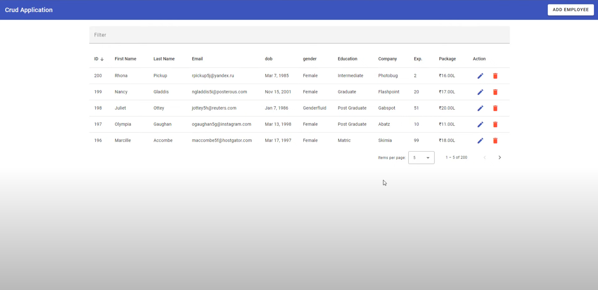
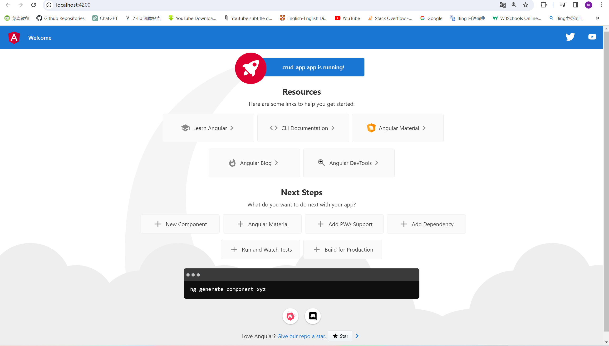

# 1. YouTube video Reference

[1-Easy-Angular 15 CRUD app using material UI  JSON-server  step by step](https://www.youtube.com/watch?v=4mKY_yDq64g&t=3904s)

2-Hard-Cafe Management System-See YouTube


Final Page Outlook:

Header,目录



# 2. Angular 15 CRUD APP

## 2.1 create the project and run

ng: newly grad/ next generation

```
ng new [yourProjectName]
# example
ng new crud-app
Choose:
Add routing
SCSS
```

After installation:

```
ng serve -o
```

in cmd(not powershell).

See:



## 2.2 Visit https://material.angular.io/

### 2.2.1 Add ng-material

```
ng add @angular/material
```

Choose a color you like.