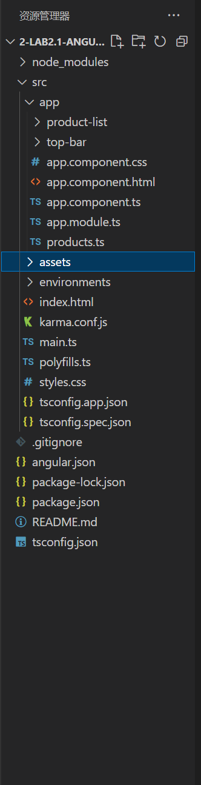

## 1-CreateTheSampleProject

1.The running page of this sample project features two areas:

- A top bar with the store name, `My Store`, and a checkout button
- A header for a product list, `Products`

The project section on the left shows the source files that make up the application, including the infrastructure and configuration files.

2.project section on the left:

