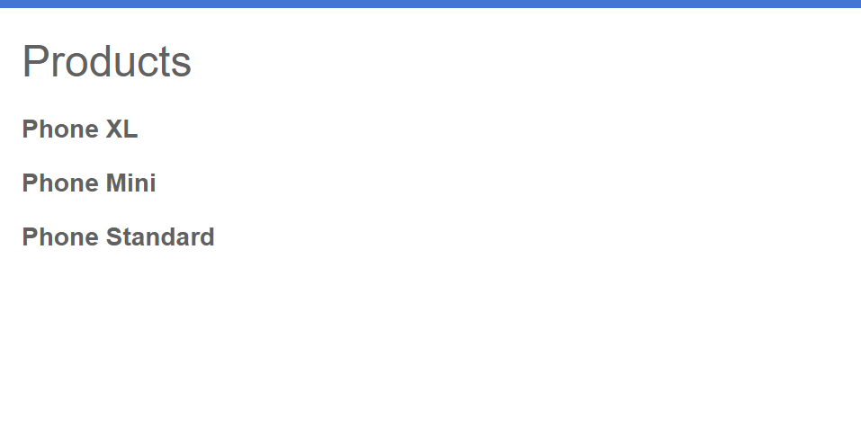

## 2.2-using-ngFor-IterateAList.md

**brief**

Learn the `*ngFor` structural directive to iterate through a list in ts(typescript)

**content**

1.

Add an `*ngFor` structural directive on a `<div>`, as follows.

```
<h2>Products</h2>

<div *ngFor="let product of products">

</div>
```

With `*ngFor`, the `<div>` repeats for each product in the list in `product-list.component.ts`

Structural directives shape or reshape the DOM's structure, by adding, removing, and manipulating elements. For more information about structural directives, see [Structural directives](https://angular.io/guide/structural-directives).

**Note: What is a DOM in html tree? I don't know.**

2.

Inside the `<div>`, add an `<h3>` and `{{product.name}}`.

The `{{product.name}}` statement is an example of Angular's interpolation syntax.

Interpolation `{{ }}` lets you render the property value as text.

```
<h2>Products</h2>

<div *ngFor="let product of products">

  <h3>
      {{ product.name }}
  </h3>

</div>
```


**What does this code do?**

1.It goes to the `products.ts`file under folder `src/app`,and it then acquires the products in this file.

2.It shows everything in the `products.ts` file.


**Expected Result:**

Now you can see all of the

```
product.name
```

in `products.ts` appearing on your website.

**expected result:**

