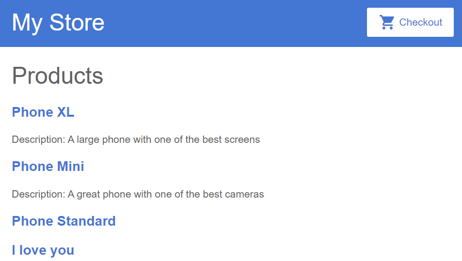

## 2.4-Add Product Descriptions

1.Now we add the product descriptions.

On a `<p>` element, use an 

```
*ngIf
```

directive so that Angular only creates the 

```
<p>
```

element **if the current product has its description.**

**changed code:**

```
...
</a>
  </h3>
  <!-- Newly added Code -->
  <p *ngIf="product.description">
    Description: {{ product.description }}
  </p>
</div>
```

**expected result:**



**explanation:**

The application now displays the name and description of each product in the list. Notice that the final product `Phone Standard` does not have a description paragraph. 

Angular doesn't create the `<p>` element because the product's description property is empty.

