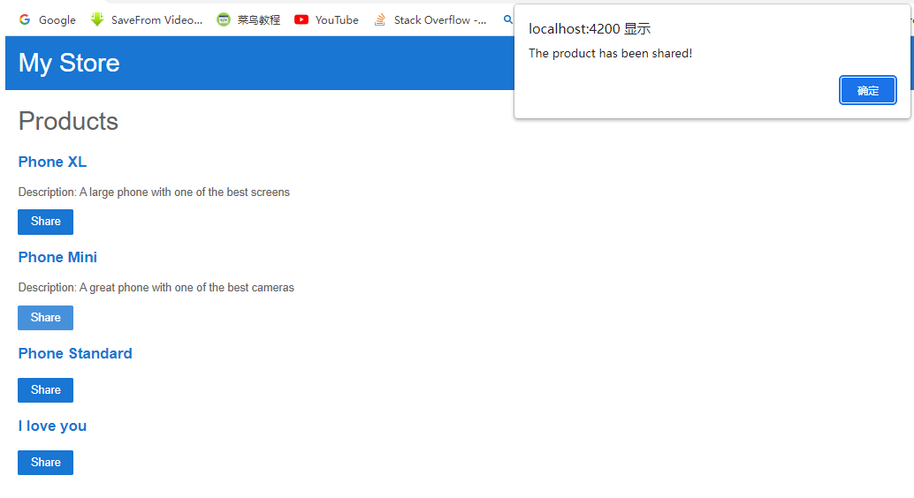

## 2.5-Add Buttons To Share Products.md

1.Add a button so that users can share a product.

Bind the button's `click` event to the `share()` method in `product-list.component.ts`. Event binding uses a set of parentheses, `()`, around the event, as in the `(click)` event on the `<button>` element.

**changed source code:**

```
...
    Description: {{ product.description }}
  </p>

  <button type="button" (click)="share()">
    Share
  </button>

</div>
```

**expected result:**



**explanation:**

Well, it now just alert the page when you click the share button.

No actual share has been initialized.

Each product now has a **Share** button.

Clicking the **Share** button triggers an alert that states, "The product has been shared!".

## 2.5.2-Reference to introduction to components and templates

In editing the template, you have explored some of the most popular features of Angular templates. For more information, see [Introduction to components and templates](https://angular.io/guide/architecture-components#template-syntax).