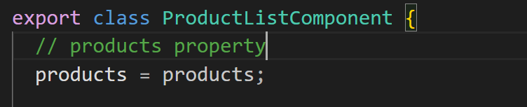
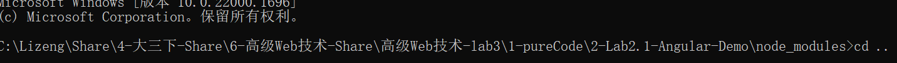

## 2.6 Pass data to a child component

### 2.6.0-自己整理的教程

#### 目标：

我们希望在父组件中复用子组件，并使用父组件中的数据(其他组件中的数据，实际上)来对子组件中的内容进行规划。

步骤：

1.进入项目工程总目录，输入如下cmd命令

```
ng generate component [componentName]
// In this project:
ng generate component product-alerts
```

**expected result:**

在项目的src/app文件夹下将会出现一个新类，名为[componentName],主力有如下三大文件:

```
.ts
.html
.css
```

文件。

2.我们先进入对应ts文件一探究竟。

a.对于@Component处代码：

```
@Component({
  // 父组件要选中子组件需要用的html标签
  selector: 'app-product-alerts',
  // 模板html+css代码样式(其是真正呈现给用户的内容)
  templateUrl: './product-alerts.component.html',
  styleUrls: ['./product-alerts.component.css']
})
```

解释如上。

b.对于export class ProductAlertsComponent类：

```
它就是它，要被导入的类
```

3.对ts文件进行修改：

添加代码：

```
import Input from '@angular/core';
import {Product} from '../products';
```

作用：让子组件能接收父组件数据

4.在类内部定义一个带@Input()的注解，该注解能让类内部成员吸收外部变量值。

```
export class ProductAlertsComponent {

  @Input() product!: Product;

}
```

5.现在我们进入html页面，给这个组件带来一些形体

```
<p *ngIf="product && product.price > 700">
  <button type="button">Notify Me</button>
</p>
```

6.需要导入该组件，还需要在app.module.ts中加入该组件相应的代码，幸运的是generator(步骤一)已经帮我们自动加入了如下代码

```
import { ProductAlertsComponent } from './product-alerts/product-alerts.component';

@NgModule({
  declarations: [
    AppComponent,
    TopBarComponent,
    ProductListComponent,
    ProductAlertsComponent,
  ],
```

8.在父组件中引用子组件

进入我们的主程序页面product-list.component.html,添加如下代码

```
<button type="button" (click)="share()">
  Share
</button>

<app-product-alerts
  [product]="product">
</app-product-alerts>
```

9.期待结果


### 2.6.1-官网教程

Currently, the product list displays the name and description of each product.

The `ProductListComponent` also defines a `products` property 



that contains imported data for each product from the `products` array in `products.ts`.

The next step is to create a new alert feature that uses product data from the `ProductListComponent`. The alert checks the product's price, and if the price is greater than $700, displays a **Notify Me** button that lets users sign up for notifications when the product goes on sale.

This section walks you through creating a child component, `ProductAlertsComponent`, that can receive data from its parent component, `ProductListComponent`.

### 2.6.2 Steps

**1.create a new terminal under the current working directory.(this time it's 2-LAB2.1-ANGULAR-DEMO)**



using `cd ..` to change back to the 2-Lab2.1-Angular-Demo folder. 

**2.In the new terminal, generate a new component named `product-alerts` by running the following command:**

```
ng generate component product-alerts
```

The generator creates starter files for the three parts of the component:

```
product-alerts.component.ts
product-alerts.component.html
product-alerts.component.css
```

**3.Open `product-alerts.component.ts`.**

The `@Component()` decorator indicates that the following class is a component.

`@Component()` also provides metadata about the component, including its selector, templates, and styles.

**source code:**

`src/app/product-alerts/product-alerts.component.ts`

```
@Component({
  selector: 'app-product-alerts',
  templateUrl: './product-alerts.component.html',
  styleUrls: ['./product-alerts.component.css']
})
export class ProductAlertsComponent {


}
```

**explanation:**

key features in the `@Component()` are as follows:

e1.The `selector`, `app-product-alerts`, identifies the component. By convention, Angular component selectors begin with the prefix `app-`, followed by the component name.

e2.The templateUrl and styleUrl filenames reference the component's HTML and CSS.

e3.The `@Component()` definition also exports the class, `ProductAlertsComponent`, which handls functionality for the component.


**4.To set up `ProductAlertsComponent` to receive product data, first import `Input` from `@angular/core`**

```
souruce code file: src/app/product-alerts/product-alerts.component.ts
import { Component, Input } from '@angular/core';
import { Product } from '../products';
```


5.In the `ProductAlertsComponent`class definition, define a property named `product` with an `@Input()` decorator.

The `@Input()` decorator indicated that the property value passes in from the component's parent, `ProductListComponent`.

```
source code file:src/app/product-alerts/product-alerts.component.ts
export class ProductAlertsComponent {

  @Input() product!: Product;

}
```


6.Open `product-alerts.component.html` and replace the placeholder paragraph with a **Notify me** button that appears if the product price is over $700.

// **Note**: 这种展示源代码的方式挺好的

展示源代码方式：

希望我也能在typora中搞成这样


```
source code file:src/app/product-alerts/product-alerts.component.html
<p *ngIf="product && product.price > 700">
  <button type="button">Notify Me</button>
</p>
```


7.使用组合的方式将子组件与父组件绑定。

The generator automatically added the `ProductAlertsComponent` to the `AppModule` to make it available to other components in the application.

```
source code file:src/app/app.module.ts
...
// This sentence should be naturally added by your cmd command
import {ProductAlertsComponent} from './product-alerts/product-alerts.component';


@NgModule({
	declarations:[
		AppComponent,
		TopBarComponent,
		ProductListComponent,
		ProductAlertsComponent,
	],
```


8.Finally, to display `ProductAlertsComponent` as a child of `ProductListComponent`, add the `<app-product-alerts>` element to `product-list.component.html`. Pass the current product as input to the component using property binding.

```
source code file: src/app/product-list/product-list.component.html

// source code:
<button type = "button" (click)="share()">
Share
</button>

<app-product-alerts
	[product]="product">
</app-product-alerts>
```


9.expected result here


10.**explanation**

The new product alert component takes a product as input from the product list.

With that input, it shows or hides the **Notify Me** button, based on the price of the product.

The Phone XL price is over %=$700, so the **Notify Me** btn appears on the product.


## 2-Reference

1.网址：https://angular.io/start#pass-data-to-a-child-component
