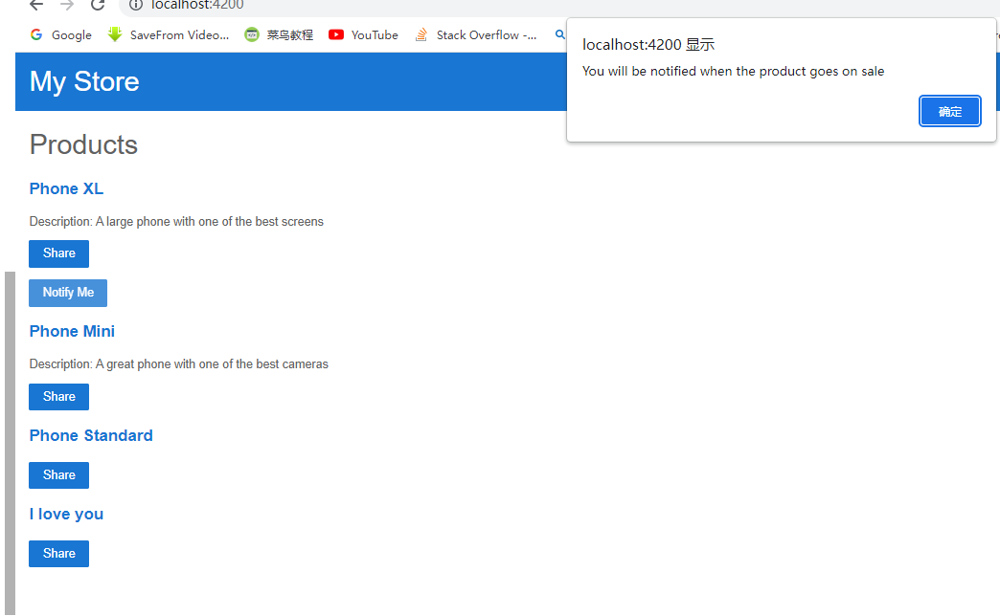
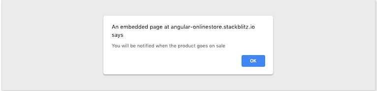

## 2.7-Pass data to a parent component

### 2.7.0-我的总结

#### 目标：通过子组件中的内容通知父组件要做的事

#### Step

1.在父组件代码中加入愿意倾听子组件的内容

```
<!-- 选中位于product-alerts.componet.ts中的组件: app-product-alerts -->
    <app-product-alerts 
        [product]="product"
        (notify)="onNotify()"
    >
```


2.在父组件中定义onNotify()函数

```
export class ProductListComponent {
  // products property
  products = [...products];

  share() {
    window.alert('The product has been shared!');
  }
  
  onNotify() {
    window.alert('You will be notified when the product goes on sale');
  }
}
```


3.在子组件的ts文件中定义输出组件

```
// 导入输出组件
import { Component, Input, Output, EventEmitter } from '@angular/core';

export class ProductAlertsComponent {
  // 初始化product为Product类
  @Input() product!: Product;
  // 类中加入输出组件
  @Output() notify = new EventEmitter();

  constructor() { }

  ngOnInit() {
  }

}
```


4.在子组件的html文件中加入点击时的召唤函数

```
<!-- judge the product's price to show the btn -->
<p *ngIf="product && product.price > 700">
  <button type="button" (click)="notify.emit()">Notify Me</button>
</p>
```

(click)="notify.emit()"


5.期待结果



### 2.7.1-官网教程

#### 前言

1.To make the **Notify Me** button work, the child component needs to notify and pass the data to the parent component. 

2.The `ProductAlertsComponent` needs to emit an event when the user clicks **Notify Me** and the `ProductListComponent` needs to respond to the event.

3.In new components, the Angular Generator includes an empty `constructor()`, the `OnInit` interface, and the `ngOnInit()` method. 

4.Since these steps don't use them, the following code examples omit them for brevity.

#### Steps

1.In `product-alerts.component.ts`, import `Output` and `EventEmitter` from `@angular/core`.

```
source code file: src/app/product-alerts/product-alerts.component.ts

import { Component, Input, Output, EventEmitter } from '@angular/core';
import { Product } from '../products';
```


2.In the component class, define a property named `notify` with an `@Output()` decorator and an instance of `EventEmitter()`. 

**explanation:**

Configuring `ProductAlertsComponent` with an `@Output()` allows the `ProductAlertsComponent` to emit an event when the value of the `notify` property changes.

```
source code file: src/app/product-alerts/product-alerts.component.ts
export class ProductAlertsComponent {
  @Input() product: Product | undefined;
  @Output() notify = new EventEmitter();
}
```


3.In `product-alerts.component.html`, update the **Notify Me** button with an event binding to call the `notify.emit()` method.

```
source code file: src/app/product-alerts/product-alerts.component.html
<p *ngIf="product && product.price > 700">
  <button type="button" (click)="notify.emit()">Notify Me</button>
</p>
```

Newly added code:

```
(click)="notify.emit()"
```


4.Define the behavior that happens when the user clicks the button. The parent, `ProductListComponent` —not the `ProductAlertsComponent`— acts when the child raises the event. In `product-list.component.ts`, define an `onNotify()` method, similar to the `share()` method.


```
source code file: src/app/product-list/product-list.component.ts
export class ProductListComponent {

  products = [...products];

  share() {
    window.alert('The product has been shared!');
  }

  onNotify() {
    window.alert('You will be notified when the product goes on sale');
  }
}
```

5.Update the `ProductListComponent` to receive data from the `ProductAlertsComponent`.

In `product-list.component.html`, bind `<app-product-alerts>` to the `onNotify()` method of the product list component. 

`<app-product-alerts>` is what displays the **Notify Me** button.

src/app/product-list/product-list.component.html

```
<button type="button" (click)="share()">
  Share
</button>

<app-product-alerts
  [product]="product" 
  (notify)="onNotify()">
</app-product-alerts>
```

6.Click the **Notify Me** button to trigger an alert which reads, "You will be notified when the product goes on sale".



7.For more information on communication between components, see [Component Interaction](https://angular.io/guide/component-interaction).