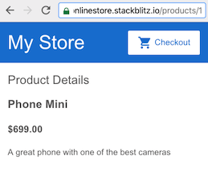

## 2.8-Adding Navigation-实现路由跳转

### 2.8.1-Official document

#### 2.8.1.1-brief

This guide builds on the first step of the Getting Started tutorial, [Get started with a basic Angular app](https://angular.io/start).

At this stage of development, the online store application has a basic product catalog.

In the following sections, you'll add the following features to the application:

1.Type a URL in the address bar to navigate to a corresponding product page

2.Click links on the page to navigate within your single-page application

3.Click the browser's back and forward buttons to navigate the browser history intuitively


#### 2.8.1.2-Associate a URL path with a component

0.The application already uses the Angular `Router` to navigate to the `ProductListComponent`. This section shows you how to define a route/router to show individual product details.

1.Generate a new component for product details. 

In the terminal generate a new `product-details` component by running the following command:

```shell
ng generate component product-details
```

2.In `app.module.ts`, add a route for product details, with a `path` of `products/:productId` and `ProductDetailsComponent` for the `component`.

```
source code file: src/app/app.module.ts
@NgModule({
  imports: [
    BrowserModule,
    ReactiveFormsModule,
    RouterModule.forRoot([
    // default root for angular path
      { path: '', component: ProductListComponent },
      { path: 'products/:productId', component: ProductDetailsComponent },
    ])
  ],
  declarations: [
    AppComponent,
    TopBarComponent,
    ProductListComponent,
    ProductAlertsComponent,
    ProductDetailsComponent,
  ],
```

3.Open `product-list.component.html` in vscode, not in google chrome.

4.

Modify the product name anchor to include a `routerLink` with the `product.id` as a parameter.

```
source code file: src/app/product-list/product-list.component.html
<div *ngFor="let product of products">

  <h3>
    <a
      [title]="product.name + ' details'"
      [routerLink]="['/products', product.id]">
      {{ product.name }}
    </a>
  </h3>

  <!-- . . . -->

</div>
```

The `RouterLink` directive helps you customize the anchor element. 

In this case, the route, or URL, contains one fixed segment, `/products`. 

The final segment is variable, inserting the `id` property of the current product. 

For example, the URL for a product with an `id` of 1 would be similar to `https://getting-started-myfork.stackblitz.io/products/1`.

5.Verify that the router works as intended by clicking the product name. The application should display the `ProductDetailsComponent`, which currently says "product-details works!"

Notice that the URL in the preview window changes. \

**The final segment is `products/#` where `#` is the number of the route you clicked.**

**Note**: should not be undefined!!!


#### 2.8.1.3-View product details using routing information

**brief**

The `ProductDetailsComponent` handles the display of each product. 

The Angular Router displays components based on the browser's URL and [your defined routes](https://angular.io/start/start-routing#define-routes).

In this section, you'll use the Angular Router to combine the `products` data and route information to display the specific details for each product.

**Step**

1.In `product-details.component.ts`, 

import `ActivatedRoute` from `@angular/router`, and the `products` array from `../products`.

```
source code file: src/app/product-details/product-details.component.ts
import { Component, OnInit } from '@angular/core';
import { ActivatedRoute } from '@angular/router';

import { Product, products } from '../products';
```


2.Define the `product` property.

// Don't know the meaning of `Product | undefined`

```
source code file: src/app/product-details/product-details.component.ts

export class ProductDetailsComponent implements OnInit {

  product: Product | undefined;
  /* ... */
}
```


3.

Inject `ActivatedRoute` into the `constructor()` by adding `private route: ActivatedRoute` as an argument within the onstructor's parentheses.


```
source code file: src/app/product-details/product-details.component.ts

export class ProductDetailsComponent implements OnInit {

  product: Product | undefined;

  constructor(private route: ActivatedRoute) { }

}
```

`ActivatedRoute` is specific to each component that the Angular Router loads. `ActivatedRoute` contains information about the route and the route's parameters.

By injecting `ActivatedRoute`, you are **configuring the component to use a service**. 

The [Managing Data](https://angular.io/start/start-data) step covers services in more detail.


4.

In the `ngOnInit()` method, extract the `productId` from the route parameters and find the corresponding product in the `products` array.

```
source code file: src/app/product-details/product-details.component.ts

ngOnInit() {
  // First get the product id from the current route.
  const routeParams = this.route.snapshot.paramMap;
  const productIdFromRoute = Number(routeParams.get('productId'));

  // Find the product that correspond with the id provided in route.
  this.product = products.find(product => product.id === productIdFromRoute);
}
```


The route parameters correspond to the path variables you define in the route. To access the route parameters, we use `route.snapshot`, which is the `ActivatedRouteSnapshot` that contains information about the active route at that particular moment in time. The URL that matches the route provides the `productId` . Angular uses the `productId` to display the details for each unique product.


5.Update the `ProductDetailsComponent` template to display product details with an `*ngIf`. 

If a product exists, the `<div>` renders with a name, price, and description.


```
source code file: src/app/product-details/product-details.component.html
<h2>Product Details</h2>

<div *ngIf="product">
  <h3>{{ product.name }}</h3>
  <h4>{{ product.price | currency }}</h4>
  <p>{{ product.description }}</p>
</div>
```

The line, `<h4>{{ product.price | currency }}</h4>`, uses the `currency` pipe to transform `product.price` from a number to a currency string. A pipe is a way you can transform data in your HTML template. For more information about Angular pipes, see [Pipes](https://angular.io/guide/pipes).

6.**expected result**

When users click on a name in the product list, the router navigates them to the distinct URL for the product, shows the `ProductDetailsComponent`, and displays the product details.



For more information about the Angular Router, see [Routing & Navigation](https://angular.io/guide/router).


#### 2.8.1.4-What's next

You have configured your application so you can view product details, each with a distinct URL.

To continue exploring Angular:

1.处理数据-Continue to [Managing Data](https://angular.io/start/start-data) to add a shopping cart feature, manage cart data, and retrieve external data for shipping prices

2.部署-Skip ahead to [Deployment](https://angular.io/start/start-deployment) to deploy your application to Firebase or move to local development