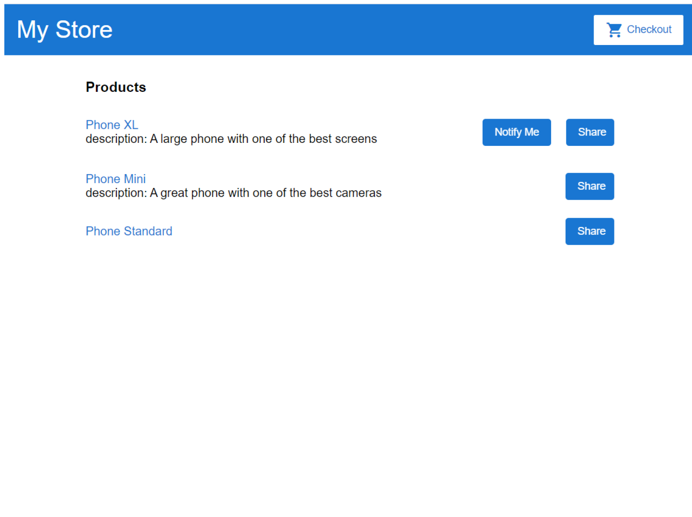

##  2.9-Angular And Material.md

很遗憾，这部分内容没找到网络资源，只能看助教的文档了-文档还“不够好”。

### 2.9.0 brief

Material UI 是一款功能非常强大，界面却十分清新简洁的CSS框架，Material UI利用了Google的
Material Design 全新设计语言，并且让每一个UI组件都变得非常独立，因此开发者使用Material UI也会比
较简单。和Bootstrap类似，Material UI提供了很多常用的UI组件，包括菜单、按钮、滑动杆、进度条、单
选框/复选框等等。
本节我们将借助material IU的列表控件 (Lists) 来优化界面，最终实现目标如下图所示

### 2.9.1-经典 npm install 环节(先求神拜佛一波再说)

1.命令行打开项目目录

2.安装前请先确认：当前node版本为：v16.14.2

3.尝试在国内环境下下载依赖包，尝试30min后失败。

3.执行如下命令，安装material UI的依赖包

```
npm install --save @angular/material @angular/cdk @angular/animations
```

4.报错：

```
npm ERR! code ERESOLVE npm ERR! ERESOLVE unable to resolve dependency tree
```

并提示

```
npm ERR! Fix the upstream dependency conflict, or retry
npm ERR! this command with --force, or --legacy-peer-deps
npm ERR! to accept an incorrect (and potentially broken) dependency resolution
```


5.google搜索解决办法

6.在stackoverflow上尝试指令

```
npm install --save --legacy-peer-deps
```

即获得成功。

然后再

```
npm install --save --legacy-peer-deps @angular/material @angular/cdk @angular/animations 
或者
npm install --save --force @angular/material @angular/cdk @angular/animations 
```

7.未安装成功@angular/material

重新安装：

```
npm install --save --legacy-peer-deps @angular/material
```

8.NPM报网络错误

9.尝试set proxy to https://registry.npmjs.com/nodemon using below command.（不靠谱）

```
npm config set registry "http://registry.npmjs.org/
```

10.尝试使用神奇命令

```
npm config set strict-ssl false
```

11.重新安装

```
npm install --save --force @angular/material
```

神奇命令10竟然生效！！！震惊！！！

7.测试安装是否成功

进入package.json,查看dependencies的更新，期待如下：


要多一份@angular/core以及相关内容

### 2.9.2-期待页面



### 2.9.3-导入代码

1.在`app.module.ts`中导入需要使用的material组件

```
import { MatToolbarModule } from '@angular/material/toolbar';
import { MatListModule } from '@angular/material/list';
import { MatButtonModule } from '@angular/material/button';
import { MatCardModule } from '@angular/material/card';

    @NgModule({
    imports: [
    BrowserModule,
    BrowserAnimationsModule,
    ReactiveFormsModule,
    MatButtonModule, MatCardModule,
    MatToolbarModule, MatListModule,
    RouterModule.forRoot([
    { path: '', component: ProductListComponent },
    { path: 'products/:productId', component: ProductDetailsComponent },
    ])
    ],
    declarations: [...]
    bootstrap: [ AppComponent ]
    })
```

2.用list控件重写product-list.component.html

3.

```
<mat-list style="width: 80%;margin: 0 auto;">
<h3 mat-subheader>Products</h3>
<mat-list-item *ngFor="let product of products; index as productId">
<h4 mat-line>
<a [title]="product.name + ' details'" [routerLink]="['/products',
productId]">
{{ product.name }}
</a>
</h4>
<p mat-line *ngIf="product.description">
description: {{ product.description }}
</p>
<app-product-alerts [product]="product" (notify)="onNotify()">
</app-product-alerts>
<button style="margin-left: 20px;" mat-raised-button color="primary"
(click)="share()">Share</button>
</mat-list-item>
</mat-list>
```

<mat-list> 是一个容器组件，它包装并格式化一系列<mat-list-item> 。基本格式如下：

```
<mat-list>
<mat-list-item>列表 行1</mat-list-item>
<mat-list-item>列表 行2</mat-list-item>
......
<mat-list-item>列表 行n</mat-list-item>
</mat-list>
```

4. 定义product-list.component.css

```
.example-card {
	max-width: 400px;
}
.example-header-image {
background-image:
url('https://material.angular.io/assets/img/examples/shiba1.jpg');
background-size: cover;
}
```

安装部分明天再说，实在不行就和郭说的一样，用原生html+css语法部署ta的页面，不要用助教的垃圾方法制作这个页面。
