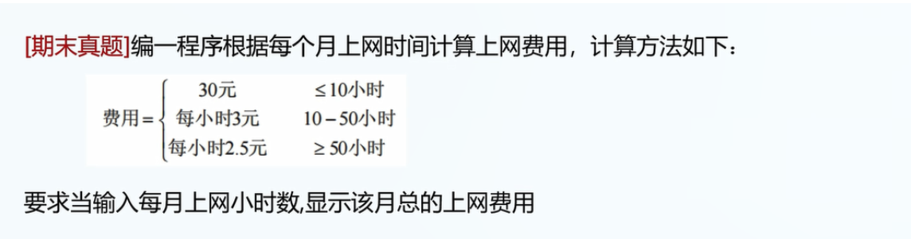

1.大部分内容与JS内容保持一致.

2.看一些有区别的代码:

A.赋值语句的区别

JS常见写法:

```
var x = 1;
x="123"; // 没问题
```

TS常见错误:

```
var x = 1;
x="123"; // 错误,因为x已默认成为了number类型变量,不能给number类型变量赋string类型值.
```


B.关系运算符: 

JS的常见错误(Don't be too clever):

```
1<x<2: 到底对于程序来说是什么?
// 是判断x在(1,2)范围里面嘛?

// 实例代码
var x = 3;
if(1<x<2){
    console.log("x is between 1 and 2");
}
// 没有报错.
// 依然会输出!

// 错误,因为计算机会错误理解你的意思.
当true or false和整数相比较时,
强制类型转换: true=1, false =0
// 所以这段代码:
1<x<2: 默认都会执行,因为不论x>1或x<=1, 1<x的返回值都会<2.
```

在TS中再写一遍实例代码:

```
var x = 3;
if(1<x<2){
    console.log("x is between 1 and 2");
}

// 1<x<2默认报错.
```

问题: 为什么ts会报错,js不报错?

答案: 类型检查立大功!

ts不允许隐式强制类型转化.


C.用ts实现如下题目:



答案:

```
var hour = 0;
var payment = 0;

hour = Number(prompt("请输入每月上网小时数"));

if(hour<=10){
    payment = 30;
}
else if (hour<=50){
    payment = 30 + (hour-10)*3;
}
else if (hour>50){
    payment = 30 + 40*3 + (hour-50)*2.5;
}
console.log(payment);
```


D.用ts实现如下题目2:


注1:百分制成绩: 默认输入整数.

