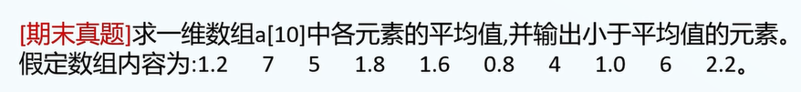
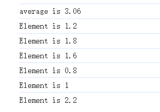

1.TS的数组和C比较像.

2.TS数组的特性: 存储**相同类型**的数据.

3.TS数组的创建(声明与初始化):

A.数组声明:

```
var x = new Array(n); // x中的元素可以是任意类型
var a: number[] ; // a中的元素必须是数值型
var b: string[] ; // b中的元素必须是字符串类型
```

B.数组初始化

```
x=[1,2,'3'];
a=[1,2];
b=["1","2"];
```

注1: 可以合并声明与初始化.

4.TS数组的读取与修改

除了必须保持变量类型一致外,其余与js一致.

例如:

```
var a:number[]=[1,2,3];
a[0]="1"; // 不合法,但js合法
```

16.一维数组真题

要求: 直接输出即可,不需要接收用户输入.



答案:

代码:

```
// 输入:
1.2 7 5 1.8 1.6 0.8 4 1.0 6 2.2
// 代码:

// 1.申请变量
	var sum = 0, average = 0, a = [1.2,7,5,1.8, 1.6, 0.8, 4, 1.0, 6, 2.2];

// 2.处理用户输入: 不用处理

// 3.程序内部逻辑
	for(var i=0;i<10;i++){
		sum+=a[i];
	}
	average = sum / 10;
	var lessThanAverage=new Array(10);
	// index用于记录小于平均值的元素在数组lessThanAverage中的最大下标,index=最大下标+1
	var index = 0 ;
	for(var i=0;i<10;i++){
		if(a[i]<average){
			// 注意:i和index不要写反
			lessThanAverage[index]=a[i];
			index++;
		}	
	}

// 4.输出答案
	// index为实际有效的最大下标+1
	// 输出平均值
	console.log("average is %f\n",average);
	// 输出小于平均值的元素
    for(var i=0;i<index;i++){
    	console.log("Element is %f\n",lessThanAverage[i]);
    }
```

显示:



17.TS数组常用函数: 同TS.