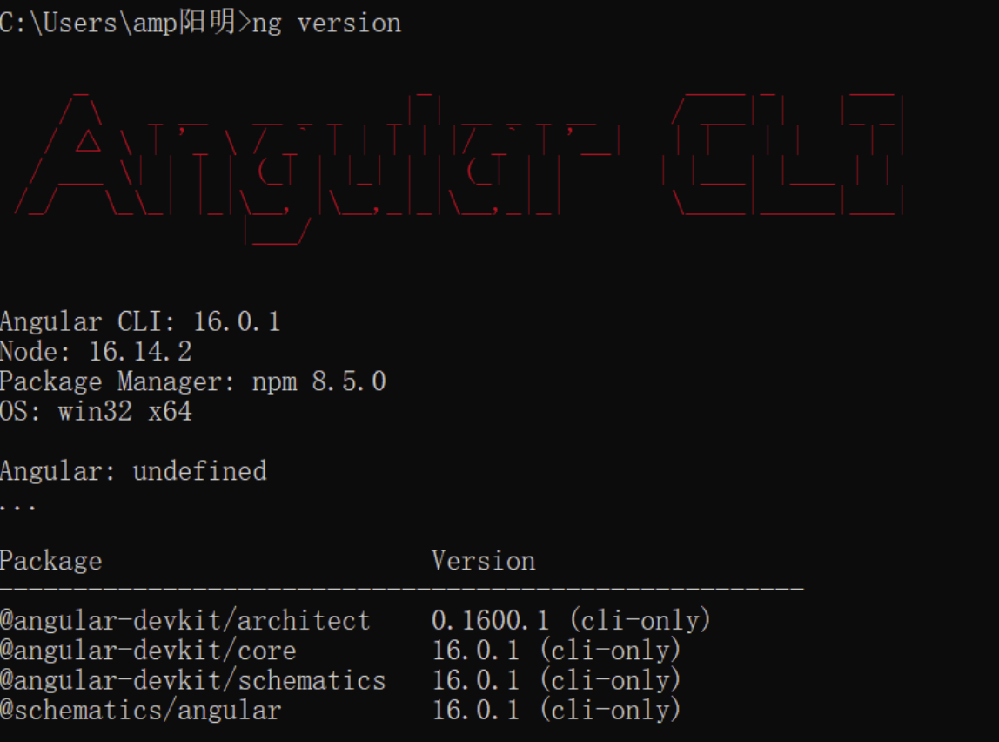
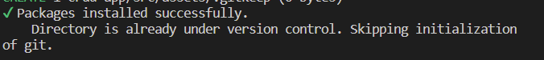
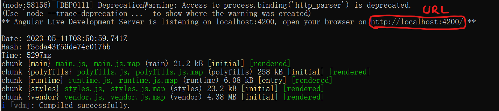
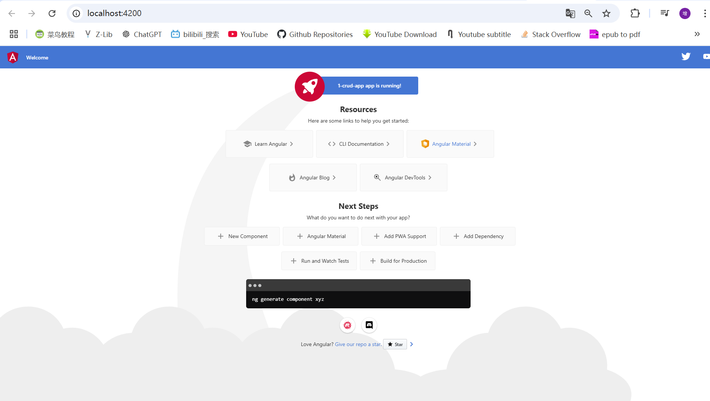

1.安装Angular CLI(脚手架),版本:16.0.1

A.Angular CLI: 用于管理Angular代码的程序,负责将Angular代码转换成浏览器能读懂的html,css,js代码.

B.安装Angular CLI:

```
指定版本:
npm install -g @angular/cli@16.0.1
解释:
-g: global,指的是全局安装.
不指定版本(不推荐):
npm install -g @angular/cli
```

注1: 在本机上安装angular脚手架，以便在之后自己动手搭建项目。

注2: 最好有VPN再装.


C.检验安装是否成功

cmd:

```
ng version
```

期待：



注3: 只有16.14.2的node版本可以安装node-CLI,18.16.0的node版本无法正常下载并安装node-CLI.请使用nvm重装Node,可见: `2-安装Node.md`.


2.新建项目demo并运行

A.Angular新建项目

```
ng new [projectName]
// 实例:
ng new 1-crud-app
```

新建一个名为crud-app的项目.

选择:


等待项目自动创建即可.

等待: 5min左右.

期待:



B.Angular运行项目:

在项目目录下执行命令:

```
ng serve
```

期待结果:



E.将上图中的URL内容复制到浏览器输入框中

```
URL: http://localhost:4200/
```

F.获得运行页面

期待:




G.也可以:

```
ng serve --open
# 更简略的写法:
ng serve --o
```

直接打开项目.

解释:

```
--open: 该参数会在服务器启动后自动在默认浏览器中打开项目。
```


3.部署Angular项目的另一个办法(不推荐,如果2中方法成功,请无视):

A.下载项目.

访问: https://github.com/2020-web/Lab2.1_Code-Angular_Demo

git clone代码到自己喜欢的文件夹即可.


B.准备电脑运行环境.

检查安装环境：

1.不要开VPN

2.node version: 16.14.2

**记得老老实实切换回16.14.2版本.**

注1:

node18.16.0版本完美自爆(有很多指令无法支持)：

尝试过但失败的解决方式：使用魔法指令（魔法指令后面也一堆错，真不如node 16.14.2 version一点儿）


C.在项目demo目录(`2-Lab2.1-Angular-Demo`)下运行命令

```
npm install
```

如果没啥问题的话，安装时请无视警告，安装时间较长(5min左右)，请耐心等待。

注1: 如果有ERR而非WARNING，必须回到步骤1.1.2，仔细准备电脑运行环境，并删除当前文件夹下的所有

```
node_modules
```

内文件，实在不行直接回到步骤1.1.1重新开始安装.


