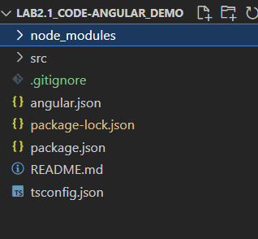
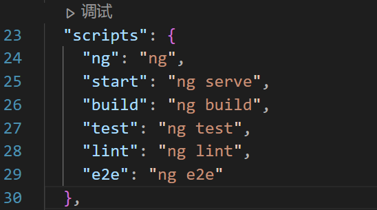

1.结合源代码文件架构对网页内容进行说明

源代码文件架构:



主要内容:

```
文件夹:
node_modules
src
文件:
.gitignore
angular.json
package-lock.json
package.json
README.md
tsconfig.json
```

下面逐一介绍各自文件与文件夹的效果.


2.node_modules文件夹:

主要存放: 

写代码的时候不用管这个文件夹.

Angular框架需要的一些组件,这些组件是框架需要运行你写的源代码所必需的外部代码包引入.

之后在写源代码时我们会继续介绍,简单来说这是Angular框架赖以生存的条件,一般不改node_modules下面的内容.


3.src文件夹:

主要存放程序员写的代码,在这里自定义你的网页内容.


4.

```
.gitignore文件:
```

用于git文件管理,不用管.


5.angular.json和package-lock:

可以理解成angular框架协助管理整个项目代码的目录文件,不用动.


6.package.json:

重要部分:

```
  "scripts": {
    "ng": "ng",
    "start": "ng serve",
	...
  }, 
```

启动:

```
ng serve
```

事实上,该命令就是我们上一节的启动代码.


注1: 该文件中的内容仅起提示作用,如果:

修改启动代码为:

```
    "start": "ng start",
```

还是不可使用

```
ng start
```

启动!

默认启动代码:

```
ng serve
```

代码图示(未修改"start"):



7.README.md与tsconfig.json: 不重要.

README.md存放Angular框架自动生成的对该项目的说明代码.

tsconfig.json: 之后会学.


下一节: 重点对src文件夹进行解析.

