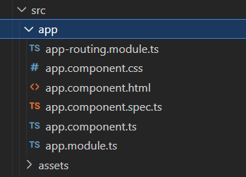
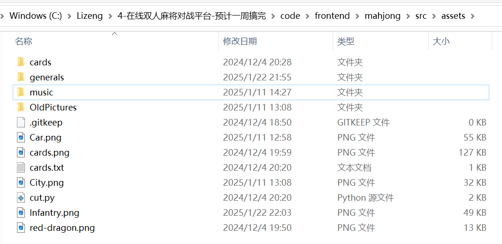

1.src文件夹结构:

2.src/app文件夹中的内容(非常重要的内容):

URL: 网址.

app-routing.module.ts: 输入不同的URL,访问不同的页面.

app.component.*: 页面的主要构成内容.

app.module.ts: 导入项目所需要的模块,控制整个app包的导入和使用.

3.app.component.*各自组成(非常重要):

A.app.component.css:修饰B的内容.

B.app.component.html:页面的骨架.

C.app.component.spec.ts:不用管,默认内容.

D.app.component.ts:管理html页面的ts代码,类似js代码.

4.src/assets文件夹:

放一些项目需要的资源,比如项目需要的图片(Car.png)

需要的资源实例:

src/app文件夹下的主要内容是由程序员用户撰写的,因此要格外注意src文件夹下的内容.

4.其他内容暂时不用管.

