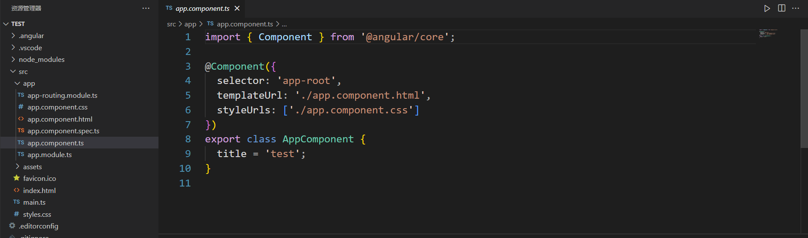
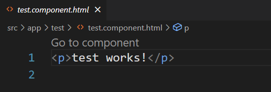

1.什么是元素?



1.给项目新建一个元素:

A.把cmd拉起来

B.cmd切到test文件夹下.

C.在cmd中输入命令:

```
ng g c test
```

语法:

```
ng g c [newComponentName]
```

语法解释:

ng: Angular命令标志

g: generate的缩写.

c: component,组件的缩写.

效果: 在app/src文件夹下生成一个新的文件夹.


注1: 尽量不要在

```
ng serve
```

的时候生成新元素,很容易卡住.

即生成新元素前,最好先把`ng serve`停掉.


2.简单看一下TestComponent:

主要构成:

A. .html文件: 很简单.



B. .css文件: 一片空白.

C. .ts文件: TestComponent.


3.使用`app-routing.module.ts`控制路由:

题目1.试着自己解释如下代码:

```
const routes: Routes = [];
```

答案: 申请一个Routes类型的变量,名字为routes,目前是空数组.


A.先将`app.component.html`中的内容替换为:

```
<router-outlet></router-outlet>
```

效果: 其中塞的html元素是程序员指定的,在特定路由里面会显示特定的元素.

可以试着ng serve一下,看看效果.

期待: 一片空白.


B.在`app-routing.module.ts`中设定路由:

复习: ts数组与js对象.

routes格式: 数组,其中每个对象都是指定的路由.

语法

```
const routes: Routes =[
	对象1,
	对象2,
	...
]
```

每个对象的基本格式:

```
{path: 'pathName', component: 'AngularComponent'}
```

实例:

```
const routes: Routes = [
  {path:"test",component:TestComponent},
]
```


C.期待效果:


D.总结:

通过将`app.component.html`中的内容换成

```
<router-outlet></router-outlet>
```

并将`app-routing.module,ts`中的const route: Routes换成我们自定义的数组+对象形式,我们可以指定在访问某些页面时,显示我们自定义的Angular元素.

这就叫"Angular的动态路由".


E.习题1.

访问test1路径时,得到TestComponent.