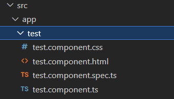

1.分析: 我们创建的项目结构.

上一节中,我们新建了一个元素,现在我们要就这个新建的元素作文章.

2.分析新建的元素:

新建元素的位置: 默认在app文件夹下生成[元素名]文件夹.

图示:



3.分析: html与ts文件的关系:

html中的可以引用ts中的内容.

4.以下称Angular中的html为Angular-Html,称原本的html为原生-html语言.

即区分Angular-HTML和原生html代码.

下面介绍Angular-HTML中引入的内容:

A.支持数据绑定

回想html: 如何改变页面中的元素?

事实上我们不知道如何改变页面中的元素.

那么Angular-html呢?

我们只需要在ts文件中定义一个变量,就可以在html中引入该变量.

"创初读修":

创+初:

```
export class TestComponent {
    x:number;
    constructor(){
    	x=1;
    }
}
```

读(html的读):

```
<p>{{x}}</p>
```

引用ts文件中定义的x元素.


B.