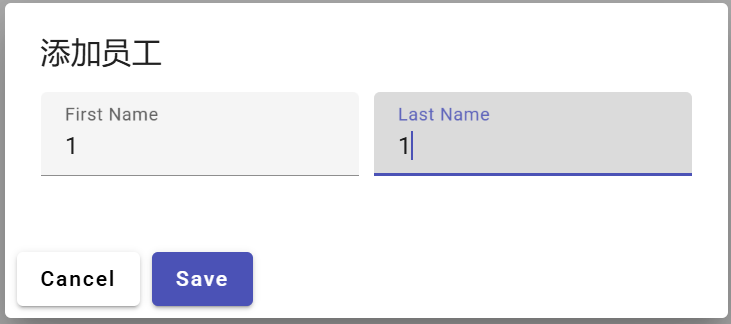
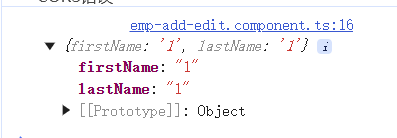

原本的用于展示页面的代码:

```
<div class="row">
    <mat-form-field>
        <mat-label>First Name</mat-label>
        <input matInput>
    </mat-form-field>
    <mat-form-field>
        <mat-label>Last Name</mat-label>
        <input matInput>
    </mat-form-field>
</div>
```


1.现在用户可以在`<input matInput>`中输入内容,但是问题是: 我们要如何读取用户的输入?

2.使用FormGroup对用户输入的内容进行管理.

通过"创初读修"进行分析.


3.创(html):

A.在app.module.ts中导入需要的模块:

```
import { ReactiveFormsModule } from '@angular/forms';
```

并:

```
  imports: [
	...,
    ReactiveFormsModule
  ],
```


B.在html中申请FormGroup.

修改后的html代码:

```
  <form [formGroup]="employeeForm">
    <div class="row">
		...
		<input matInput formControlName="firstName"> // 本行需要修改
		<input matInput formControlName="lastName"> // 本行需要修改
    </div>
  </form>
```


4.初(ts):

A.在ts中解决对应的变量的问题.

创建对应变量:

```
import { FormGroup, FormControl } from '@angular/forms'; // 导入内容
  // 创建 FormGroup
  employeeForm = new FormGroup({
    firstName: new FormControl(''),
    lastName: new FormControl('')
  });
```


5.读(ts):

A.html中:

从:

```
<button mat-raised-button mat-dialog-close color="primary" >Save</button>
```

改成:

```
<button mat-raised-button mat-dialog-close color="primary" (click)="onSave()" >Save</button>
```

B.在ts中创建onSave()函数:

```
	onSave(){
		console.log(this.employeeForm.value);
	}
```

C.测试:

输入:



输出:




