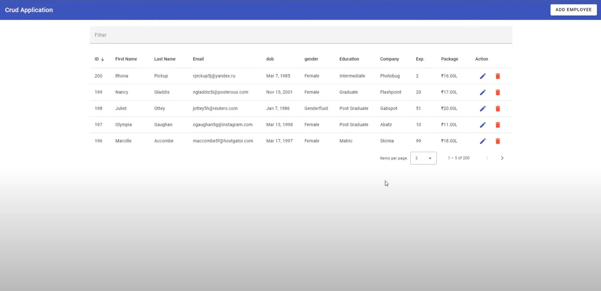

1.回到我们新建的项目文件夹下,打开vscode.

2.运行命令(添加Angular Material):

```
# 不指定版本(不推荐):
ng add @angular/material
# 指定版本:
ng add @angular/material@16.2.14
```

参考网址: https://material.angular.io/

3.目标页面格式:




Reference: 

[1-Easy-Angular 15 CRUD app using material UI  JSON-server  step by step](https://www.youtube.com/watch?v=4mKY_yDq64g&t=3904s)

2-Hard-Cafe Management System-See YouTube


