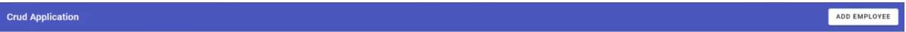
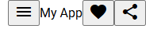
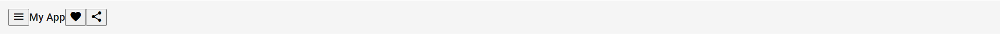
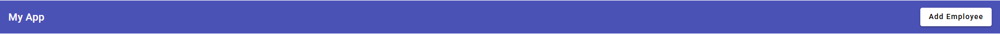

导航栏样式:



1.所有文件的入口:

`app.component.html`

记得删除其中的所有内容.

2.参考页面访问网址: https://material.angular.io/components/categories

3.安装: Angular Language Service,作为Angular的插件.

下次记得试试Angular Snippets.

3.使用Angular Material参考网址上的Toolbar工具栏构建导航栏骨架(html+css+ts代码)

A.导入html代码构成页面骨架.

在网址https://material.angular.io/components/categories下

点击查看html、css、ts代码.

以下将html、css、ts代码简称为htc代码(有一款手机的名字叫做htc).

希望导入的html代码:

Reference: https://material.angular.io/components/icon/api

```
<mat-toolbar>
  <button mat-icon-button class="example-icon" aria-label="Example icon-button with menu icon">
    <mat-icon>menu</mat-icon>
  </button>
  <span>My App</span>
  <span class="example-spacer"></span>
  <button mat-icon-button class="example-icon favorite-icon" aria-label="Example icon-button with heart icon">
    <mat-icon>favorite</mat-icon>
  </button>
  <button mat-icon-button class="example-icon" aria-label="Example icon-button with share icon">
    <mat-icon>share</mat-icon>
  </button>
</mat-toolbar>
```

报错原因:

有尚未引入的模块:

```
<mat-toolbar> ... </mat-toolbar>
<mat-icon> ... </mat-icon>
```


B.处理报错(通过TS代码处理报错):

在app.module.ts中添加类似代码:

```
import {Component} from '@angular/core';
import {MatIconModule} from '@angular/material/icon';
import {MatButtonModule} from '@angular/material/button';
import {MatToolbarModule} from '@angular/material/toolbar';

/**
 * @title Toolbar overview
 */
@Component({
  selector: 'toolbar-overview-example',
  templateUrl: 'toolbar-overview-example.html',
  styleUrl: 'toolbar-overview-example.css',
  imports: [MatToolbarModule, MatButtonModule, MatIconModule],
})

```


C.查找尚未引入的模块,并在`app.module.ts`中导入.

为了引入对应的hct代码,我们需要先告诉项目代码组织目录: 引入对应的module.

管理项目(app)的module的文件: `app.module.ts`

D.在`app.module.ts`中导入对应代码.

D.照葫芦画瓢,请学生自己安装MatIconModule.

导入后的期待:




E. 事实上,这是因为框架没有检测到新引入的内容.

我们需要重新启动框架:

```
ng serve
```

即可.

重启后的期待:



导航栏骨架做好了.


4.使用css使导航栏比较漂亮

导入css代码:

```
.example-spacer {
  flex: 1 1 auto;
}
```

4.讲述原理

5.删除一些无关紧要的内容.

```
  <button mat-icon-button class="example-icon" aria-label="Example icon-button with menu icon">
    <mat-icon>menu</mat-icon>
  </button>
```

记得保留

```
  <span class="example-spacer"></span>
```

用以填充中间的内容.


6.新建一个可以点击的button,并修改导航栏样式:

标签名:

```
button
```

属性1:

```
mat-raised-button
```

内容:

```
  <button mat-raised-button>Add Employee</button>
```

顺便给:

```
<mat-toolbar>
```

添加一个属性为:

```
color="primary"
```

变成:

```
<mat-toolbar color="primary">
```

顺便修改:

```
<span>My App</span>
```

为:

```
<span>Crud Application</span>
```


期待效果:




7.随笔: Angular Material的好处:

```
color="primary"
```

这种

```
属性名="属性值"
```

的代码,在Angular里面写起来很方便.

而纯净的html代码就要这样写:

```
<button style="color:blue;"> ... </button>
```

Angular只要写成html格式就行.


为了方便地定义元素的颜色属性,Angular Material引入了一系列新的好的特性.


