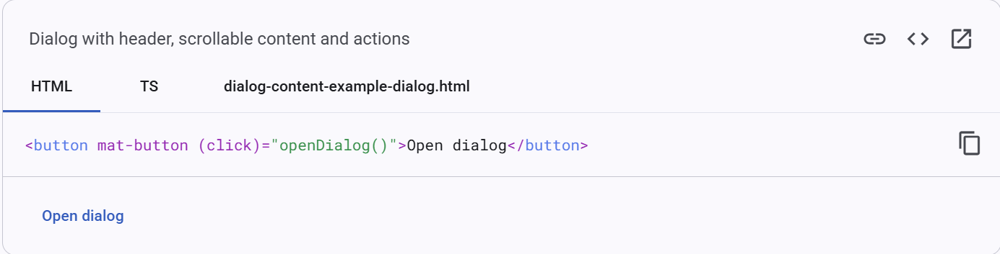

1.在上一节中,我们新建了一个导航栏,修改了其样式为我们想要的模样,但是我们没有办法在点击"Add Employee"按钮的时候真正添加员工.

2.所以我们希望管理员在需要添加员工的时候,可以点击按钮并添加员工入整个系统.

3.构建跳出来的对话框对应的页面.

Angular新建元素:

```
ng g c emp-add-edit
```

效果: 在app目录下新建一个元素,包含: ts,html,css文件.

4.思考: 如何建立按钮与新元素之间的联系?

效果:在点击"Add Employee"按钮时,应当跳出对话框,用以添加员工.

去material页面寻找素材.

Angular Material: https://material.angular.io/

使用Angular Material 对话框建立联系.

5.使用MatDialog元素

来看这一段代码:

