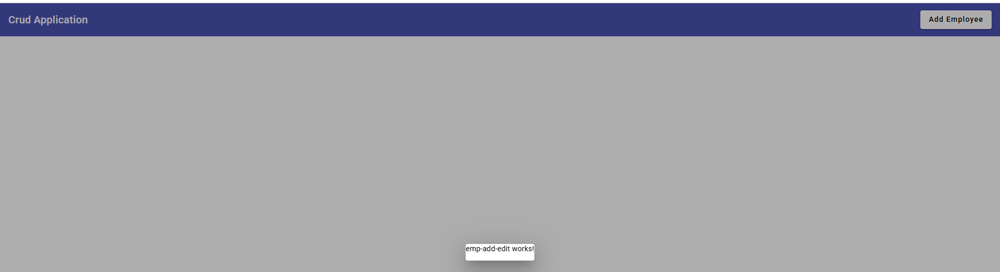
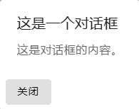

1.在上一节中,我们新建了一个导航栏,修改了其样式为我们想要的模样,但是我们没有办法在点击"Add Employee"按钮的时候真正添加员工.


2.所以我们希望管理员在需要添加员工的时候,可以点击按钮并添加员工入整个系统.


3.构建跳出来的对话框对应的页面.

Angular新建元素:

```
ng g c emp-add-edit
```

效果: 在app目录下新建一个元素,包含: ts,html,css文件.


4.思考: 如何建立按钮与新元素之间的联系?

效果:在点击"Add Employee"按钮时,应当跳出对话框,用以添加员工.

去material页面寻找素材.

Angular Material: https://material.angular.io/

使用Angular Material 对话框建立联系.

5.使用MatDialog元素

来看这一段代码:


解释:

新建一个mat-button,在点击时调用某个函数,函数名为openDialog().

函数定义位置: ts文件.

6.测试调用是否成功:

在.ts文件中撰写如下代码:

```
export class AppComponent {
  openDialog(){
    console.log("Open Dialog!");
  }
}
```

运行后自行测试是否成功.

7.改变openDialog()函数中的代码为打开EmpAddEditComponent的动作:

回到https://material.angular.io/components/dialog/overview

8.使用: MatDialogComponent弹出对话框:

A.在app.module.ts中导入MatDialogComponent.

B.使用constructor在AppComponent中导入MatDialog:

B1.导入MatDialog:

```
import { MatDialog } from '@angular/material/dialog';
```

B2.在构造时导入MatDialog(不用管是怎么导入的,只需要知道如下代码能导入MatDialog模块即可):

```
export class AppComponent {
  title = '1-crud-app';

  dialog: MatDialog;

  constructor(dialog:MatDialog){
    this.dialog = dialog;
  }

  openDialog(){
    // console.log("Open Dialog!");
    this.dialog.open(EmpAddEditComponent);
  }
}
```

B3.语法糖:

```
export class AppComponent {
  title = '1-crud-app';
  // 此乃语法糖
  constructor(private dialog:MatDialog){
  }

  openDialog(){
    // console.log("Open Dialog!");
    this.dialog.open(EmpAddEditComponent);
  }
}
```

期待效果:




9.MatDialog的html主要组成部分:

```
<div mat-dialog-title>这是一个对话框</div>
<div mat-dialog-content>这是对话框的内容。</div>
<div mat-dialog-actions>
    <button mat-button mat-dialog-close>关闭</button>
</div>
```

期待:



10.分析:

```
mat-dialog-title: 对话框标题
mat-dialog-content: 对话框内容
mat-dialog-actions: 对话框行为
```

