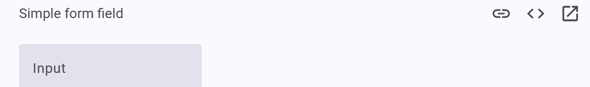
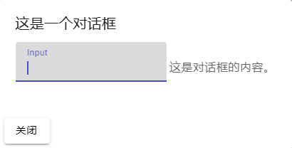
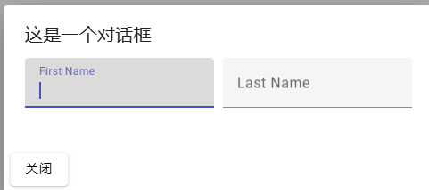

9.MatDialog的html主要组成部分:

```
<div mat-dialog-title>这是一个对话框</div>
<div mat-dialog-content>这是对话框的内容。</div>
<div mat-dialog-actions>
    <button mat-raised-button>取消</button>
    <button mat-raised-button color="primary">保存</button>
</div>
```

期待:


10.分析:

```
mat-dialog-title: 对话框标题
mat-dialog-content: 对话框内容
mat-dialog-actions: 对话框行为
```

11.在`<mat-dialog-actions>`中添加:

```
<button mat-raised-button> Cancel </button>
<button mat-raised-button color="primary"> Save </button>
```

12.因为我们希望用户输入内容,而Material中输入内容的办法: FormField组件,因此在mat-dialog-content中添加:

参考网址: https://material.angular.io/components/form-field/overview

我们想要的样式:



因此我们要:

复制html代码:

```
<mat-form-field>
  <mat-label>Input</mat-label>
  <input matInput>
</mat-form-field>
```

塞入emp-add-edit.component.html:

```
<div mat-dialog-content>
    <mat-form-field>
        <mat-label>Input</mat-label>
        <input matInput>
    </mat-form-field>
    这是对话框的内容。</div>
```

但是产生了报错:

```
<mat-form-field>
<mat-label>
```

于是查找ts代码,导入我们需要的代码即可.

装完

```
import {MatFormFieldModule} from '@angular/material/form-field';
```

之后依然不够,于是再装一个:

```
import {MatInputModule} from '@angular/material/input';
```

期待效果:




13.重整对话框样式

A.每行放两个.

```
    <div class="row">
            <mat-form-field>
                <mat-label>First Name</mat-label>
                <input matInput>
            </mat-form-field>
            <mat-form-field>
                <mat-label>Last Name</mat-label>
                <input matInput>
            </mat-form-field>
    </div>
```

目标: 让员工输入姓和名.


B.调整两个对话框间距(增加间隔).

在.css中:

```
.row{
    display: flex;
    gap: 10px;
}
```

期待效果:




